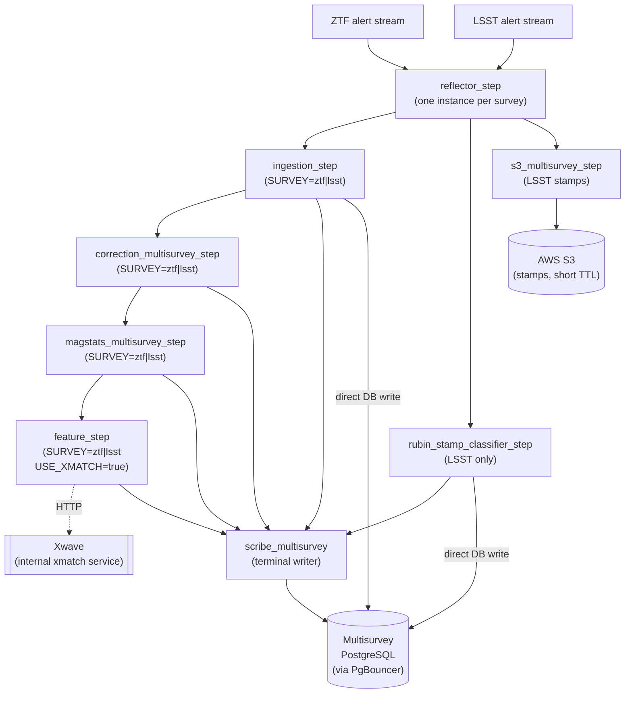

# ALeRCE Multisurvey Pipeline

> ⚠️ **This document was generated by Claude and has not been fully reviewed by the developers.** It may contain errors or outdated information. Treat it as a starting point, not as authoritative.

This document describes the **multisurvey pipeline** — the new ALeRCE processing path that handles alerts from multiple surveys (ZTF and LSST/Rubin) against a shared PostgreSQL schema.

It is a sibling to [`PIPELINE.md`](PIPELINE.md), which documents the legacy ZTF pipeline.

All steps are APF-framework microservices (event-driven, Kafka in / Kafka out). Credentials are always injected via environment variables — no secrets appear here.

---

## High-level flow

> **Note on Kafka.** Following Simon Brown's guidance for async messaging, the diagram shows direct producer → consumer edges; the Kafka transport is implicit. Topic names are injected per deployment via `CONSUMER_TOPICS` / `PRODUCER_TOPIC` env vars.

---

## Step reference

### reflector_step

**Purpose.** Mirrors an external observatory alert stream into the ALeRCE Kafka cluster, decoupling downstream steps from upstream availability and connection details. One instance is deployed per upstream survey (same codebase, different config).

**Survey support.** Per-survey instances (ZTF, LSST).

**Inputs.** External alert stream from the upstream survey.

**Outputs.** A Kafka topic on ALeRCE's cluster, consumed in parallel by `ingestion_step` and any survey-specific parallel consumers (e.g. `rubin_stamp_classifier_step` and `s3_multisurvey_step` for LSST).

**Status.** Current.

---

### ingestion_step

**Purpose.** Accepts raw survey alerts, applies survey-specific transformations (unit conversions, schema normalisation), and persists objects, detections, non-detections, and forced photometries directly to PostgreSQL. Replaces the three legacy steps: `sorting_hat`, `prv_candidates`, and `lightcurve`.

**Object identification.** The multisurvey pipeline does **not** compute a coordinate-derived ALeRCE id. Each object is identified by the pair `(oid, sid)`:
- `oid`: the original stream object id, converted to `int64`.
- `sid`: the survey id (tells you which survey the object came from).

The legacy coordinate-based ALeRCE id and the 1.5″ crossmatch lookup in `sorting_hat` have been dropped.

**Survey support.** ZTF and LSST (separate instances, one per survey, configured via `SURVEY_STRATEGY`).

**Inputs.** The reflector output topic for the configured survey; survey-specific Avro schema.

**Outputs.**
- Forward Kafka topic for downstream steps.
- Direct DB write (NullPool connection): objects, detections, non-detections, forced-photometries → multisurvey PostgreSQL (via PgBouncer).
- No scribe writes.

**Status.** Current.

**Notes.**
- Absorbs three legacy steps. The ID-assignment logic now lives here.
- ZTF transformations include `jd_to_mjd`, `fid_to_band`, `forcediffimflux_to_mag`, `isdiffpos_to_int`. LSST transformations are handled by a separate `lsst` strategy module.
- `INSERT_BATCH_SIZE` is configurable to tune DB throughput.

---

### correction_multisurvey_step

**Purpose.** Retrieves the full stored lightcurve from PostgreSQL, joins it with the incoming batch, and applies per-survey photometric corrections (difference magnitude → apparent magnitude). Emits corrected lightcurves forward and writes correction results to scribe.

**Survey support.** ZTF and LSST (separate instances, `SURVEY` config key).

**Inputs.** Ingestion output topic for the configured survey.

**Outputs.**
- Forward Kafka topic for the magstats step.
- Scribe topic (correction payloads for detections and object mean coordinates).

**Status.** Current.

**Notes.**
- Uses survey-component pattern: `input_parser`, `db_strategy`, and `joiner` are resolved at init time from a registry keyed on `SURVEY`. This avoids branching in `execute()`.
- Reads the DB with NullPool connections.

---

### magstats_multisurvey_step

**Purpose.** Computes or updates per-band magnitude statistics (magstats) and object-level statistics (objstats / mean coordinates) for each object in the batch. Unlike the legacy `magstats_step`, this step is **not terminal** — it passes the updated message forward for feature extraction.

**Survey support.** ZTF and LSST (separate instances, `SURVEY` config key).

**Inputs.** Correction output topic for the configured survey.

**Outputs.**
- Forward Kafka topic (carries updated messages with mean coordinates refreshed) for the feature step.
- Scribe topic (magstats and objstats upsert commands).

**Status.** Current.

**Notes.**
- Calculators can be excluded via `EXCLUDED_CALCULATORS` env var.

---

### feature_step

**Purpose.** Extracts per-object light-curve features and, when enabled, performs a cross-match against the AllWISE catalogue via an HTTP call to **Xwave**, the internal ALeRCE crossmatch service. The multisurvey pipeline no longer calls the external CDS xmatch service. Writes features and cross-match results to scribe; passes the enriched message forward.

**Survey support.** ZTF and LSST (same codebase, branched on `SURVEY` config key; separate deployed instances).

**Inputs.** Magstats output topic for the configured survey.

**Outputs.**
- Forward Kafka topic (configurable via `PRODUCER_TOPIC`) for downstream classification.
- Scribe topic (configurable via `SCRIBE_TOPIC`).
- HTTP call (outbound): `XmatchClient.conesearch_with_metadata()` to the internal Xwave service when `USE_XMATCH=true`. Cross-match results are sent to scribe immediately; they are also attached to messages before feature extraction.

**Status.** Current.

**Notes.**
- In the legacy pipeline a dedicated `xmatch_step` consumed the correction output and passed it on, and the crossmatch was served by the external CDS service. In the multisurvey pipeline the crossmatch is performed inline inside `feature_step.pre_execute()` via HTTP to the internal Xwave service, eliminating both the separate Kafka step and the external dependency.
- `ZTFFeatureExtractor` and `LSSTFeatureExtractor` are instantiated at init time. Reference data (PS1, sharpnr, chinr) is fetched from PostgreSQL for ZTF.
- `MIN_DETECTIONS_FEATURES` guards objects with too few detections.

---

### rubin_stamp_classifier_step

**Purpose.** Applies the Rubin stamp-based ML classifier to raw LSST alerts to produce per-object class probabilities. Writes probabilities directly to PostgreSQL and emits scribe commands for archival.

**Survey support.** LSST only.

**Inputs.** The LSST reflector output topic (runs in parallel with `ingestion_step`; does **not** consume ingestion output).

**Outputs.**
- Direct DB write: probabilities table → multisurvey PostgreSQL.
- Scribe topic (probability archival commands, `step=probability-archival-step`).
- Forward Kafka topic with classifier output, intended for downstream community brokers (e.g. Rubin/DESC).

**Status.** Current.

**Notes.**
- Asteroids (non-zero `ssObjectId`) are assigned probability 1.0 to the `asteroid` class without running the model.
- Fields missing from older alert schemas (`airmass`, `magLim`, `scienceFlux`, `seeing`) are filled with constants and logged as warnings.

---

### stamp_classifier_2025_multisurvey_step

**Purpose.** Multi-scale ZTF stamp classifier adapted for the multisurvey database. Reads ZTF raw alerts, maps ZTF `objectId` to the multisurvey `oid`, classifies stamps, and writes probabilities directly to PostgreSQL and to scribe.

**Survey support.** ZTF only (reads ZTF-format alerts: `objectId`, `candidate.*`, `cutoutScience`, etc.).

**Inputs.** A ZTF raw alerts topic (configurable via `CONSUMER_TOPICS`; runs in parallel with ingestion, not downstream of it).

**Outputs.**
- Direct DB write: probabilities table → multisurvey PostgreSQL.
- Scribe topic (probability archival commands, `step=probability-archival-step`, `survey=ztf`).
- Forward Kafka topic (daily-topic-strategy output).

**Status.** Beta.

**Notes.**
- Stamps must be 63×63 pixels; other sizes are silently dropped.
- `catalog_oid_to_masterid("ZTF", objectId)` is used to convert ZTF objectIds to multisurvey integer oids.

---

### s3_multisurvey_step

**Purpose.** Saves LSST alert stamps (science, difference, template cutouts packed as Avro) to AWS S3 with a short bucket-level lifecycle TTL.

**Survey support.** LSST only.

**Inputs.** The LSST reflector output topic (parallel consumer, independent of the ingestion chain).

**Outputs.**
- AWS S3: one Avro file per alert, named `{diaObjectId}_{diaSourceId}.avro` (or `{ssObjectId}_...` for solar system objects).
- No Kafka forward topic. No scribe writes.

**Status.** Current.

**Notes.**
- Only stamps (cutouts) are written to S3; full alert archival is handled separately and is not yet a formal step in this folder (see "Known limitations").
- Upload is parallelised with a `ThreadPoolExecutor` (default 10 workers).
- `SURVEY_ID=lsst` selects the `LSSTAlertManager` which extracts only the three cutout fields.

---

### scribe_multisurvey

**Purpose.** Terminal consumer of the multisurvey scribe topic. Translates JSON command payloads into SQL DML and executes them against the multisurvey PostgreSQL schema (via PgBouncer).

**Survey support.** Both (survey-agnostic; processes all multisurvey scribe messages).

**Inputs.** The multisurvey scribe Kafka topic.

**Outputs.**
- Direct DB write: multisurvey PostgreSQL via PgBouncer. Supported operations: insert, update, upsert (`update_probabilities`, `update_features`).
- No forward Kafka topic.

**Status.** Current.

**Notes.**
- `pre_execute` deduplicates `magstat` and `magstat_objects` messages within a batch, keeping only the record with the highest detection count / latest MJD, before handing off to `execute`.
- `ALLOWED_COMMANDS` config key can restrict which command types are accepted.

---

## Differences from the legacy ZTF pipeline

| Concern | Legacy ZTF | Multisurvey |
|---|---|---|
| ID assignment + prv candidates + lightcurve fetch | Three separate steps: `sorting_hat` → `prv_candidates` → `lightcurve` | Single `ingestion_step` per survey |
| DB writes for raw detections | Via `scribe` step | Direct from `ingestion_step` |
| Cross-match with AllWISE | Dedicated `xmatch_step` consuming correction output, calling external CDS service | Inline HTTP call from `feature_step` to internal **Xwave** service |
| Object identification | Coordinate-derived ALeRCE id assigned by `sorting_hat` (1.5″ crossmatch) | `(oid, sid)` — original stream object id as int64 + survey id; no coordinate-based id |
| Scribe payloads | MongoDB-oriented command format | SQL upsert commands |
| Scribe backend | MongoDB | PostgreSQL via PgBouncer |
| `magstats_step` role | Terminal (pipeline ends here for many paths) | Non-terminal: passes forward to `feature_step` |
| Survey isolation | ZTF only | Per-survey instances sharing a single topic namespace and DB schema |
| Stamp archival | Full alerts to S3 (`s3_step`) | Stamps only to S3 (`s3_multisurvey_step`); full-alert archival not yet a formal step |

---

## Planned / under development

The following steps exist in the repository for the legacy pipeline and are not yet ported to the multisurvey path:

- **lc_classification** — light-curve classifier consuming feature output.
- **lc_anomaly** — anomaly detection on light curves.
- **watchlist** — user-defined cone-search alerts.
- **tns_reporter** — TNS cross-match and reporting.
- **Output streams** — forwarding to institutional users.
