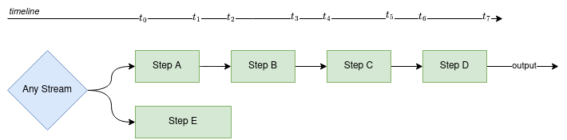
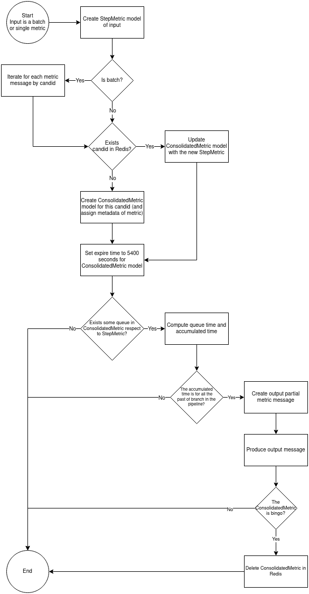

[](https://codecov.io/gh/alercebroker/consolidated_metrics_step)
[](https://github.com/alercebroker/consolidated_metrics_step/actions/workflows/unit_tests.yaml)
[](https://github.com/alercebroker/consolidated_metrics_step/actions/workflows/integration_tests.yaml)

# Consolidated Metrics Step

A simple step that computes queue, execution and total times. The functionalities of this step are:
- Compute queue times, accumulated time and execution times by candid in every step.
- Store partial metrics in Redis.
- Produce partial metrics in Kafka.

# Develop set up
1. Install requirements and some libraries to test the step:
```bash
pip install pytest pytest-docker coverage
```
2. To run tests:
```bash
# Unit tests
coverage run --source consolidated_metrics_step/ -m pytest -x -s tests/unit/

# Integration tests: redis and kafka
python -m pytest -x -s tests/integration/
```
3. Install `pre-commit` with
```bash
pip install pre-commit
```
4. Install the git hook scripts. Run pre-commit install to set up the git hook scripts.
```bash
pre-commit install
```
5. When you go to do a commit, the `pre-commit` plugin will verify if satisfies tests, black, imports, etc. The same `pre-commit` will fix your files, and you must do a commit again, but with `pre-commit` changes.


# Infrastructure needed
This step requires:
- Cluster of Kafka for consume and produce metrics.
- Redis for store metrics.

# Key concepts



- Execution time: The time that one message is being processed in the step. For example, the `Execution_StepA` is `t1 - t0`.
- Queue time: The time that one message spends in Kafka topic, without being processed. For example, the `Queue_StepA_StepB` is `t2 - t1`.
- Accumulated time: The total time that one message is partially in one branch of the pipeline. For example the message it's coming out of `Step B`, the accumulated time until `Step B` is `t3 - t0` or `Execution_StepA + Queue_StepA_StepB + Execution_StepB`.

## The input
The input of this step is a **metric** that all step in ALeRCE pipeline produce in JSON format. The example of basic metrics defined in APF for an alert or batch:
```json
{
  "timestamp_received": "2022-09-23T13:43:18.398120+00:00",
  "timestamp_sent": "2022-09-23T13:43:18.485955+00:00",
  "execution_time": 0.087835,
  "candid": "01a59845o0560c_000580",
  "n_messages": 1,
  "source": "StepA"
}
```

```json
{
  "timestamp_received": "2022-09-23T13:45:37.736291+00:00",
  "timestamp_sent": "2022-09-23T13:45:37.750359+00:00",
  "execution_time": 0.014068,
  "candid": [
    "01a59845o0560c_000580",
    "01a59845o0559c_008911",
    "01a59845o0559c_009134"
  ],
  "oid": [
    "1002513541641239296",
    "1235406331550907136",
    "1235110041550148096"
  ],
  "aid": [
    "AL22kndpvuwehaavo",
    "AL22mypjuekqpzzaa",
    "AL22mynhfivxfxrpc"
  ],
  "tid": [
    "ATLAS-01a",
    "ATLAS-04a",
    "ATLAS-02a"
  ],
  "n_messages": 3,
  "source": "StepB"
}
```


## The output
The output of this step is a **partial metric**. Why? Because for track every alert in real-time through its candid, we need to produce an output quickly. If we wait for all metrics for a specific candid, can be possible that a candid never come to the end of the pipeline, because a step can filter alerts by one condition, for example the `Step C` filter the shorts lightcurves, so all alerts associated with shorts lightcurves never will come to `Step D`.

All partial metrics is produced by a `KafkaMetricsProducer`, this producer create an output in JSON format in Kafka.

```json
{
  "candid": "01a59845o0560c_000580",
  "survey": "ATLAS-01a",
  "milestone": "Queue_StepA_StepB",
  "queue_time": 1.642331,
  "accumulated_time": 2.876123
}
```

**Note:** The partial metrics are produced one by one. Not in batch.


# How to work consolidated metrics?

For manage the Redis operations, we use `redis_om` library for Python. So we created the following models:

```python
from redis_om import EmbeddedJsonModel, Field, JsonModel
from typing import Optional

class StepMetric(EmbeddedJsonModel):
    received: datetime
    sent: datetime
    execution_time: float  # in seconds

class ConsolidatedMetric(JsonModel):
    candid: str = Field(index=True)
    survey: str
    s3: Optional[StepMetric]
    early_classifier: Optional[StepMetric]
    watchlist: Optional[StepMetric]
    sorting_hat: Optional[StepMetric]
    ingestion: Optional[StepMetric]
    xmatch: Optional[StepMetric]
    features: Optional[StepMetric]
    late_classifier: Optional[StepMetric]
```

With these models we can Insert, Update and Delete records in Redis. The records are indexed by `candid` field, so the operations are very fast to database.

The sequence of this step is defined in teh following diagram flow:



The step modify the Redis database with all input, but the operation can variate respect to the status of the ConsolidateMetric. For the example pipeline we could have:


- Candid 1: The metrics for this candid is very advance, and has some queues ready to produce (`Queue_StepA_StepB` and `Queue_StepB_StepC`) and we can compute the `accumulated_time` until `Step C`.
- Candid 2: All the metrics is ready, we can compute every queue times and accumulated time. Also, we can delete this record (is bingo!).
- Candid 3: We cant compute anything, we need to wait for more metrics.
- Candid 4: The same case of the Candid 3, but we have the record for the another branch.

# settings.py

For configurate this step, we need to define:
- Database credentials.
- Kafka configuration.
- The pipelines order, for example for the example pipeline we need to pass the name of the pipeline and the order:

```python
PIPELINE_ORDER = {
    "EXAMPLE_PIPELINE": {
        "Step_A": {
            "Step_B": {
                "Step_C": {
                    "Step_D": None
                }
            }
        },
        "Step_E": None,
    },
}
```
