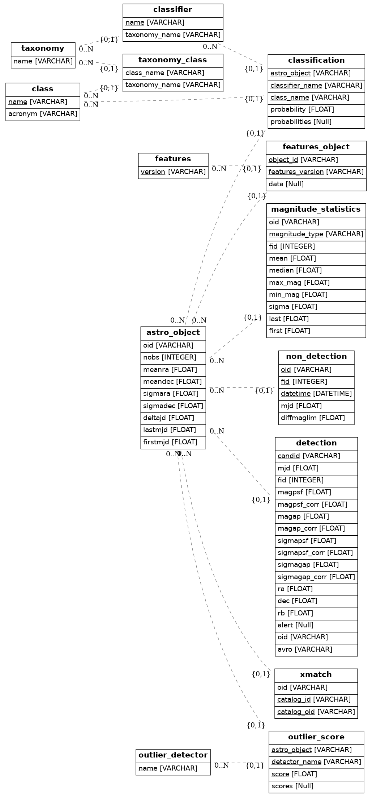

.. image:: https://github.com/alercebroker/db-plugins/workflows/UnitTests/badge.svg
.. image:: https://github.com/alercebroker/db-plugins/workflows/IntegrationTest/badge.svg
.. image:: https://codecov.io/gh/alercebroker/db-plugins/branch/master/graph/badge.svg
  :target: https://codecov.io/gh/alercebroker/db-plugins

Database Plugins for ALeRCE documentation
=========================================

*db_plugins* is an ORM style library created to interact with different databases. The main feature of these plugins is to provide an interface for database querying, reducing the amount of code and helping to decouple components.

Installing *db_plugins*
=======================

*db_plugins* installation can be done with *pip*. You can clone the repository and then

.. code-block:: console

   pip install .

Alternatively, to automatically install the additional development requirements, you can use

.. code-block:: console

   pip install .[dev]

or you can install it directly from github

.. code-block:: console

   pip install git+https://github.com/alercebroker/db-plugins.git

Database
========
ALeRCE Database module is a tool that will help you connect services like APIs and pipeline steps to a database. It works by using models that provide main operations in an abstract environment, so that you don't have to code specific database queries and instead use python classes to interact with the database.

1. Plugins
----------
ALeRCE integrates with databases through plugins. Each plugin is supposed to provide functionality for a specific database engine.

The design concept is that there are generic models that contain attributes and some methods but these are implemented in each plugin individually. For example, a PostgreSQL database will have underlying differences with a non relational database on how queries are made or on how objects are inserted, but on the higher level layer we use models with same functions so that it behaves in the same way no matter what engine is being used. This also provides the option to change database engines without having to change the application structure too much.

2. Database Initialization
--------------------------
Database plugins will read the configuration you define in a ``settings.py`` file. This file should have a `DB_CONFIG` dictionary with the database connection parameters.

Here is and example on the params used with the SQL plugin:

.. code-block:: python

   DB_CONFIG: {
       "SQL": {
           "SQLALCHEMY_DATABASE_URL": "sqlite:///:memory:"
       }
   }

After defining `DB_CONFIG` you can now initialize your database. To do so, run the ``initdb`` command as follows

.. code-block:: console

   dbp initdb

3. Migrations
-------------
When changes to models are made you would want to update the database without creating it all again, or maybe you want to undo some changes and return to a previous state.

The solution is to create migrations. Migrations keep track of your database changes and let you detect differences between your database and models and update the database accordingly.

Migrations will be created by running ``dbp make_migrations``. This command will read your database credentials from `DB_CONFIG` inside ``settings.py``.

Then, to update your database to latest changes execute ``dbp migrate``.

Database plugins
================

1. Generic classes
------------------

2. SQL
------

Initialize database
+++++++++++++++++++

Before you connect to your database, make sure you initialize it first.
To do that execute the following command from your step root folder

.. code-block:: console

   dbp initdb

When you run this command with an empty database it will create the
following schema:

Migrations
++++++++++

Migrations keep track of database changes. To fully initialize the database with your
step configuration run

.. code-block:: python

   dbp make_migrations
   dbp migrate

This will set the head state for tracking changes on the database and also execute any migrations that might be present.

The first command ``dbp make_migrations`` will create migration files according to differences from dbp models and your database.

The seccond command ``dbp migrate`` will execute the migrations and update your database.

What migrations can and can't detect
++++++++++++++++++++++++++++++++++++

Migrations will detect:

- Table additions, removals.

- Column additions, removals.

- Change of nullable status on columns.

- Basic changes in indexes

Migrations can't detect:

- Changes of table name. These will come out as an add/drop of two different tables, and should be hand-edited into a name change instead.

- Changes of column name. Like table name changes, these are detected as a column add/drop pair, which is not at all the same as a name change.

Set database Connection
+++++++++++++++++++++++

.. code-block:: python

   from db_plugins.db import SQLDatabase
   from db_plugins.db.sql.models import *

.. code-block:: python

   db_config = {
       "SQL": "sqlite:///:memory:"
   }

The URL used here follows this format: `dialect[+driver]://user:password@host/dbname[?key=value..]`

.. code-block:: python

   db = SQLDatabase()
   db.connect(config=db_config)

The above code will create a connection to the database which
we will later use to store objects.

Create model instances
++++++++++++++++++++++

Use get_or_create function to get an instance of a model. The instance
will be an object from the database if it already exists or it will
create a new instance. **This object is not yet added to the database**

.. code-block:: python

   instance, created = db.session.query().get_or_create(Model,args)

.. code-block:: python

   model_args = {
       "oid":"ZTFid",
       "nobs":1,
       "lastmjd":1,
       "meanra":1,
       "meandec":1,
       "sigmara":1,
       "sigmadec":1,
       "deltajd":1,
       "firstmjd":1
   }

.. code-block:: python

   obj, created = db.session.query().get_or_create(Object, **model_args)
   print(obj, "created: " + str(created))

.. code-block:: none

   ``<Object(oid='ZTFid')> created: False``

Add related models
++++++++++++++++++

Lets say for example that we want to create a class that belongs to a
taxonomy.

.. code-block:: python

   class_, created = db.session.query().get_or_create(Class, name="Super Nova", acronym="SN")
   print(class_)

.. code-block:: none

   ``<Class(name='Super Nova', acronym='SN')>``

.. code-block:: python

   taxonomy, created = db.session.query().get_or_create(Taxonomy, name="Example")
   print(taxonomy, "created: " + str(created))
   class_.taxonomies.append(taxonomy)

.. code-block:: none

   ``<Taxonomy(name='Example')> created: False``

.. code-block:: python

    class_.taxonomies

.. code-block:: none

   ``[<Taxonomy(name='Example')>, <Taxonomy(name='Example')>]``

.. code-block:: python

   taxonomy.classes

.. code-block:: none

   ``[<Class(name='Super Nova', acronym='SN')>]``

As you can see, adding a model works both sides.

When we add a taxonomy to a class it also means that a class is added to
the taxonomy.

Add objects to the database
+++++++++++++++++++++++++++

All our instanced objects are not yet added to the database. To do that
we use ``session.add`` or ``session.add_all`` methods

.. code-block:: python

    db.session.add(class_)
    db.session.commit()

DatabaseConnection documentation
++++++++++++++++++++++++++++++++

