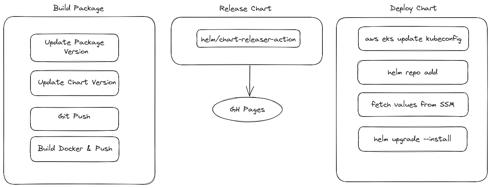

# Continuous Integration and Continuous Deployment
<!-- markdown-toc start - Don't edit this section. Run M-x markdown-toc-refresh-toc -->
**Table of Contents**

- [Continuous Integration and Continuous Deployment](#continuous-integration-and-continuous-deployment)
    - [1 Update package versions](#1-update-package-versions)
    - [2 Update chart version](#2-update-chart-version)
    - [3 Build and push package image](#3-build-and-push-package-image)
    - [4 Release chart](#4-release-chart)
    - [Deploy chart](#deploy-chart)
        - [Set up AWS and EKS authentication](#set-up-aws-and-eks-authentication)
            - [Create Github OIDC role](#create-github-oidc-role)
            - [Add role to Kubernetes configmap/aws-auth](#add-role-to-kubernetes-configmapaws-auth)
        - [Add values to SSM for each package](#add-values-to-ssm-for-each-package)

<!-- markdown-toc end -->

## Staging
The CI/CD pipeline for the staging environment is triggered by commits to the `main` branch.

There are 5 steps in the CI/CD pipeline

1. Update package versions
2. Update chart version
3. Build and push package image
4. Release chart
5. Deploy chart

The steps run using Github Actions (see [the workflow file](../.github/workflows/build_staging.yml)). The first 3 steps are encapsuled on a single Github Action job (build-dagger). Release chart and deploy have jobs for each one.



### 1 Update package versions
This step runs with Dagger. It relies on poetry managing the package's dependencies.

It goes to every package and updates the version inside the **pyproject.toml** and pushes the channges to the main branch. It requires to set up a github user that can make the push to main. The user's token must be set as a repository secret.

### 2 Update chart version
It runs as part of the same dagger pipeline as step number 1. The chart app version is synced with the updated package version (from the pyproject.toml file) and the chart version is updated with an increased patch version (i.e from 1.2.0 to 1.2.1). This is required for the release chart step later.

### 3 Build and push package image
This runs as part of the same dagger pipeline from step 1 and 2. The updated package is built using its Dockerfile and then pushed to the Github Container Registry. The github user token must be set as a repository secret.

### 4 Release chart
This step uses an external github action: helm/chart-releaser-action@v1.5.0

This action reads the versions from all charts and create a release for each updated chart. It also triggers a Github Pages build. This allows to `helm add` the repository to install charts.

It is required that at least a chart version is updated, otherwise no release will be created and the helm repository will not have any new or updated chart. This is done by step 2.

### 5 Deploy chart
This runs in a dagger pipeline. It will `helm add` the chart repository and `helm upgrade --install` the chart for each package. There is some setup needed for AWS authentication and access to the EKS cluster.

The dagger pipeline has the following stages:

1. Add the EKS configuration for kubectl
2. Fetch values from AWS Systems Manager (SSM) service
3. Upgrade chart with the fetched values

#### Set up AWS and EKS authentication
##### Create Github OIDC role
- Go to the IAM console on AWS
- Go to Identity Providers and add a new one
  - Choose OpenID Connect
  - For URL use `token.actions.githubusercontent.com`
  - For audience use `sts.amazonaws.com`
- Go to Roles and add a new one
  - Select Web Identity
  - On identity provider choose the one you just created
  - For audience select from the dropdown
  - Complete the form for the github organization (alercebroker), repository (web-services) and branch (main)
  - Click next
  - For policies choose AdministratorAccess, click next
  - Give the role a name and description
  - The trust policy should look something like this:
    ```json
    {
        "Version": "2012-10-17",
        "Statement": [
            {
                "Effect": "Allow",
                "Action": "sts:AssumeRoleWithWebIdentity",
                "Principal": {
                    "Federated": "arn:aws:iam::XXXXX:oidc-provider/my-provider"
                },
                "Condition": {
                    "StringEquals": {
                        "token.actions.githubusercontent.com:aud": [
                            "sts.amazonaws.com"
                        ],
                        "token.actions.githubusercontent.com:sub": [
                            "repo:<organization>/<repo>:ref:refs/heads/<branch>"
                        ]
                    }
                }
            }
        ]
    }
    ```
    It is crucial that you add the aud and sub conditions, otherwise there is no way of ensuring that noone else has access to use this role.
##### Add role to Kubernetes configmap/aws-auth
Full documentation: https://docs.aws.amazon.com/eks/latest/userguide/add-user-role.html

Basically, you need to update the aws-auth configmap in the kube-system namespace and add the role you created with the `system:masters` group.

``` sh
kubectl edit -n kube-system configmap/aws-auth
```

```yaml
apiVersion: v1
data:
  mapRoles: |
    # other roles here
    # you should see roles for each nodegroup
    - rolearn: arn:aws:iam::XXXX:role/role-you-created
      username: githubactions # could be any username
      groups: 
        - system:masters
```

#### Add values to SSM for each package
- Log into the SSM console in AWS
- Go to parameter store and create a new parameter
- For the name of the parameter, the pipeline step expects to read a parameter with a name of `{package}-service-helm-values` where package is the same name as the helm chart. 
- Select string type
- Select text data type
- Add the yaml file as value
