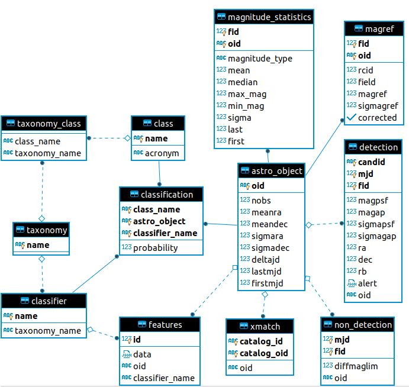

Initialize database
++++++++++++++++++++
Before you connect to your database, make sure you initialize it first.
To do that execute the following command from your step root folder

``apf initdb``

When you run this command with an empty database it will create the
following schema:

Migrations
+++++++++++++++
Migrations keep track of database changes. To fully init the database with your
step configuration run

.. code:: python

    apf make_migrations
    apf migrate

This will set the head state for tracking changes on the database and also execute any migrations that might be present.

The first command ``apf make_migrations`` will create migration files according to differences from apf models and your database.

The seccond command ``apf migrate`` will execute the migrations and update your database.

Set database Connection
++++++++++++++++++++++++

.. code:: ipython3

    from apf.db.sql import get_session, get_or_create, add_to_database
    from apf.db.sql.models import *

.. code:: ipython3

    db_config = {
        "PSQL":{
            "HOST": "localhost",
            "USER": "postgres",
            "PASSWORD": "password",
            "PORT": 5432,
            "DB_NAME": "test"
        }
    }

.. code:: ipython3

    session = get_session(db_config)

Calling the above function will create a connection to the database wich
we will later use to store objects.

Create model instances
+++++++++++++++++++++++

Use get_or_create function to get an instance of a model. The instance
will be an object from the database if it already exists or it will
create a new instance. **This object is not yet added to the database**

.. code:: python

   instance, created = get_or_create(session,Model,args)

.. code:: ipython3

    model_args = {
        "oid":"ZTFid",
        "nobs":1,
        "lastmjd":1,
        "meanra":1,
        "meandec":1,
        "sigmara":1,
        "sigmadec":1,
        "deltajd":1,
        "firstmjd":1
    }

.. code:: ipython3

    obj, created = get_or_create(session, AstroObject, **model_args)

.. code:: ipython3

    print(obj, "created: " + str(created))

.. parsed-literal::

    <AstroObject(oid='ZTFid')> created: False

Add related models
++++++++++++++++++

Lets say for example that we want to create a class that belongs to a
taxonomy.

.. code:: ipython3

    class_, created = get_or_create(session, Class, name="Super Nova", acronym="SN")
    class_

.. parsed-literal::

    <Class(name='Super Nova', acronym='SN')>

.. code:: ipython3

    taxonomy, created = get_or_create(session, Taxonomy, name="Example")
    print(taxonomy, "created: " + str(created))
    class_.taxonomies.append(taxonomy)

.. parsed-literal::

    <Taxonomy(name='Example')> created: False

.. code:: ipython3

    class_.taxonomies

.. parsed-literal::

    [<Taxonomy(name='Example')>, <Taxonomy(name='Example')>]

.. code:: ipython3

    taxonomy.classes

.. parsed-literal::

    [<Class(name='Super Nova', acronym='SN')>]

As you can see, adding a model works both sides.

When we add a taxonomy to a class it also means that a class is added to
the taxonomy.

Add objects to the database
++++++++++++++++++++++++++++

All our instanced objects are not yet added to the database. To do that
we use ``add_to_database(session, objects)`` function

.. code:: ipython3

    add_to_database(session, [class_, obj])

You can also pass a single object to
``add_to_database(session, model_instance)``

APF SQL Functions
+++++++++++++++++

.. autofunction:: apf.db.sql.get_or_create
.. autofunction:: apf.db.sql.update
.. autofunction:: apf.db.sql.get_session
.. autofunction:: apf.db.sql.add_to_database
.. autofunction:: apf.db.sql.bulk_insert
