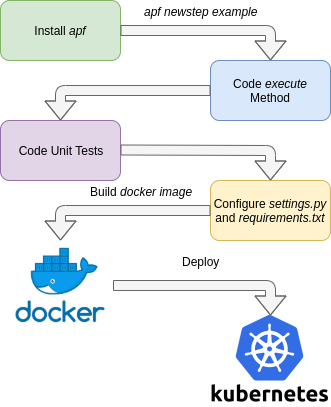

New apf step tutorial
=======================

*apf* was created to simplify the development of an stram processing pipeline.

To illustrate how the creation of a pipeline step was inteded we have the following diagram.

This tutorial will guide developers to create an example step from the installation of the framework until building and running the docker image locally.

1. Installing *apf*
----------------------

To install *apf* run

.. code-block:: bash

    pip install apf

This will install the package and a command line script.

.. code-block:: bash

    apf [-h] command

2. Creating base step
----------------------

*apf* comes with a code generation tool to create a base for a new step.

To create this base run

.. code-block:: bash

    apf newstep example_step

This command will create the following file tree

.. code-block:: text

    example_test/
    ├── example_test/
    │   ├── __init__.py
    │   └── step.py
    ├── scripts/
    │   └── run_step.py
    ├── tests/
    ├── Dockerfile
    ├── requirements.txt
    └── settings.py

The step will be a python package called `example_test`, inside the package there is
a `step.py` with the step logic.

3. Coding the step
----------------------

In `example_test/step.py` we will code the step logic, it can be as simple as printing
the message or a more complex logic. The main method called by default is the :func:`execute()` method.

.. code-block:: python

    def execute(self,message):
      ################################
      #   Here comes the Step Logic  #
      ################################

      pass

For this example we will just log the message changing the execution code to

.. code-block :: python

    def execute(self,message):
      # Logging the message
      self.logger.info(message)

Then we can go to `scripts/run_step.py`, this script runs the step, and is used
to define the step consumer, producer, backends and other plugins needed by the :func:`execute()` method.

The basic `run_step.py` comes with the following

.. code-block:: python

    consumer = GenericConsumer(config=CONSUMER_CONFIG)
    step = ExampleTest(consumer,config=STEP_CONFIG,level=level)
    step.start()

The :func:`GenericConsumer()` can be changed to another consumer i.e. a :func:`CSVConsumer()`
to read a *CSV* file.

4. Configuring the step
------------------------

After coding the step and modifying the *run_script.py* file, the step must be configured.

There are 2 files neeeded to configure a step.

1- `settings.py`:

  This file contains all the configuration passed to the consumers, producers and plugins. Having it separetly from
  the main script make it easier to change configurations from run to run.

  For good practice having environmental variables as parameters is better than hardcoding them to the settings file,
  and comes very handy when deploying the same dockerized step with different configurations.

2- `requirements.txt`

  The default requirements file for any python package, for good practice having the package with and specific version
  is better than using the latest one.

In this example we are using only the :class:`GenericConsumer()`, there is no need to specify parameters for this consumer.

5. Running the step locally
----------------------------

The step can me executed as a single process with

.. code-block :: bash

  python scripts/run_script.py

To run the step dockerized, first we need to build the step

.. code-block :: bash

  docker build -t example_step .
  docker run --rm --name example_step example_step
