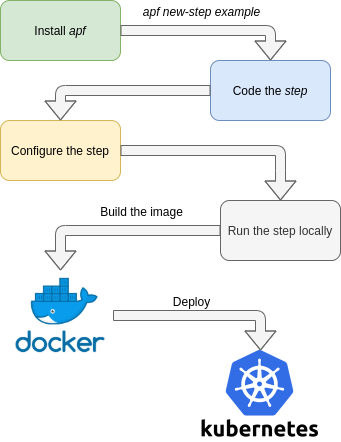

Creating a new apf step
=======================

*apf* was created to simplify the development of an stream processing pipeline.

To illustrate how the creation of a pipeline step was intended we have the following diagram.

This tutorial will guide developers to create an example step from the installation of the framework until building and running the docker image locally.

1. Installing *apf*
----------------------

To install *apf* run

.. code-block:: bash

    pip install apf_base

This will install the package and a command line script.

.. code-block:: bash

    apf [--help] command

2. Creating base step
----------------------

*apf* comes with a code generation tool to create a base for a new step.

To create this base run

.. code-block:: bash

    apf new-step example_step

This command will create the following file tree

.. code-block:: text

    example_test/
    ├── example_test/
    │   ├── __init__.py
    │   └── step.py
    ├── scripts/
    │   ├── run_multiprocess.py
    │   └── run_step.py
    ├── tests/
    ├── Dockerfile
    ├── requirements.txt
    └── settings.py

The step will be a python package called `example_test`, inside the package there is
a `step.py` with the step logic.

3. Coding the step
----------------------

In `example_test/step.py` we will code the step logic, it can be as simple as printing
the message or a more complex logic. For each new message the :func:`execute()` method is called with
a python :class:`dict` with the message itself.

.. code-block:: python

    #example_test/step.py
    def execute(self,message):
      ################################
      #   Here comes the Step Logic  #
      ################################

      pass

For this example we will just log the message changing the execution code to

.. code-block :: python

    #example_test/step.py
    def execute(self,message):
      # Logging the message
      self.logger.info(message)

Here :attr:`self.logger` is the default logger (`logging.Logger`) from :class:`apf.core.GenericStep`.

Then we can go to `scripts/run_step.py`. The basic `run_step.py` comes with the following

.. code-block:: python

    #scripts/run_step.py
    step = ExampleTest(config=STEP_CONFIG,level=level)
    step.start()

But you can pass any argument you need to define in the Step's constructor.

An alternate step initialization could look like this:

.. code-block:: python

    #scripts/run_step.py
    step = ExampleTest(
                consumer=KafkaConsumer,
                producer=KafkaProducer,
                metrics_sender=KafkaMetricsProducer,
                config=STEP_CONFIG,
                level=level
    )
    step.start()

This can be useful for tests as well, since you can pass a mock class and do not need to rely on settings, that have more boilerplate.

Starting at APF 2.0.0 the consumers, producers and metrics manager are configured only through the :attr:`config` dictionary passed to the Step class.

4. Configuring the step
------------------------

After coding the step and modifying the script, the step must be configured.

There are 2 files needed to configure a step.

1- `settings.py`:

  This file contains all the configuration passed to the consumers, producers and plugins. Having it separately from
  the main script make it easier to change configurations from run to run.

  For *good practice* having environmental variables as parameters is better than hard-coding them to the settings file,
  and comes very handy when deploying the same dockerized step with different configurations.

  The basic `settings.py` comes with the following

  .. code-block:: python

    # settings.py
    # LOGGING_DEBUG = True

    CONSUMER_CONFIG = {}
    PRODUCER_CONFIG = {}
    METRICS_CONFIG = {}
    PROMETHEUS = False

    ## Step Configuration
    STEP_CONFIG = {
        "CONSUMER_CONFIG": CONSUMER_CONFIG,
        "PRODUCER_CONFIG": PRODUCER_CONFIG,
        "METRICS_CONFIG": METRICS_CONFIG,
        "PROMETHEUS": PROMETHEUS,
    }

  We will test our step with a CSVConsumer

  .. code-block:: python

    #settings.py
    CONSUMER_CONFIG = {
      "CLASS": "apf.consumers.CSVConsumer",
      "FILE_PATH": "https://raw.githubusercontent.com/alercebroker/APF/develop/docs/source/_static/example/detections.csv",
      "OTHER_ARGS": {
          "index_col": "oid"
      }
    }

2- `requirements.txt`

  The default requirements file for any python package, for *good practice* having the package with a specific version is better than using the latest one.

  The basic `requirements.txt` comes with the current `apf` version as a required package

  .. code-block:: python

    #requirements.txt
    apf==<version>

  By default the *apf* package is already on the requirements file, so for this tutorial we will skip this step.

5. Running the step locally
----------------------------

The step can be executed with

.. code-block :: bash

  python scripts/run_step.py

To run the step dockerized, first we need to build the step

.. code-block :: bash

  docker build -t example_step .
  docker run --rm --name example_step example_step

.. note::
   Try using another `Consumer` configure it and run it locally to check it works. For example a `CSVConsumer` or a `JSONConsumer`
