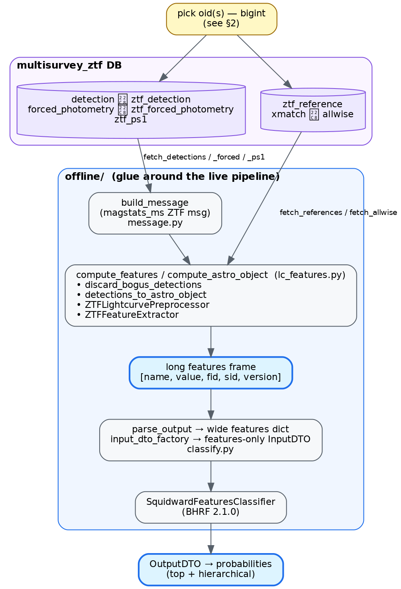
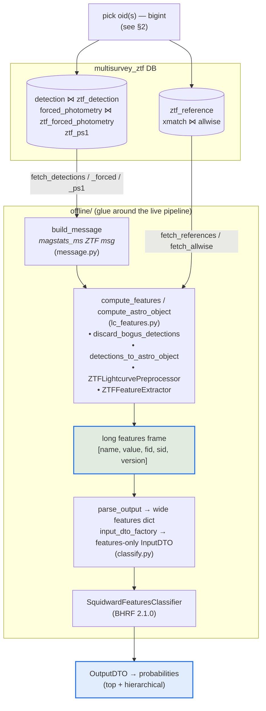
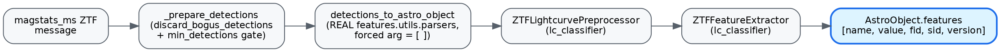
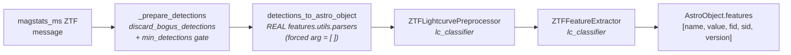
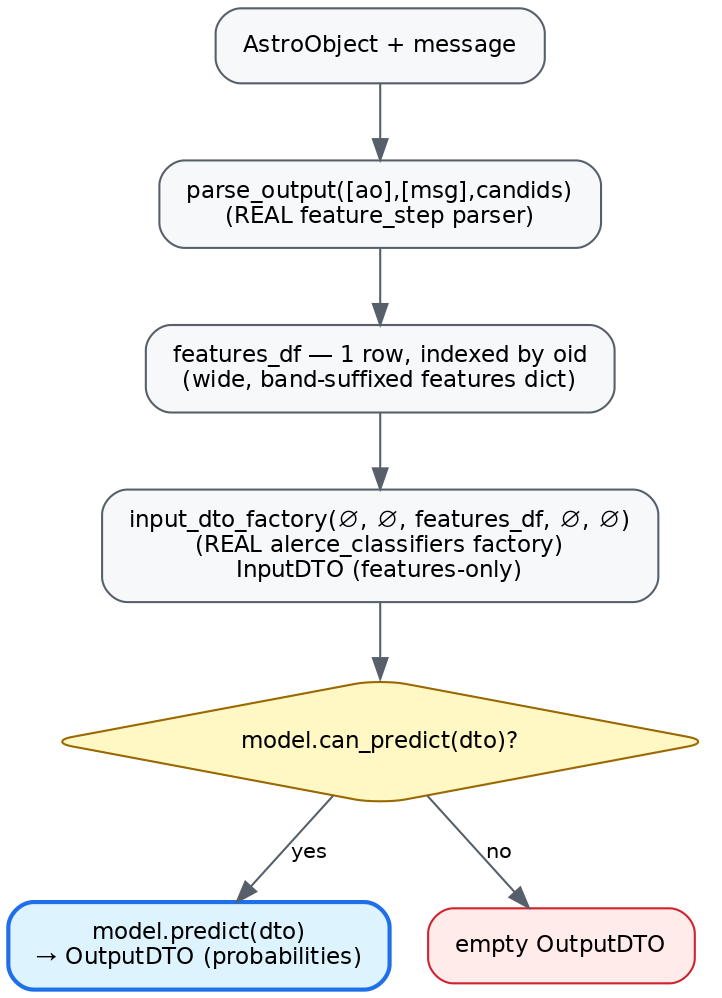
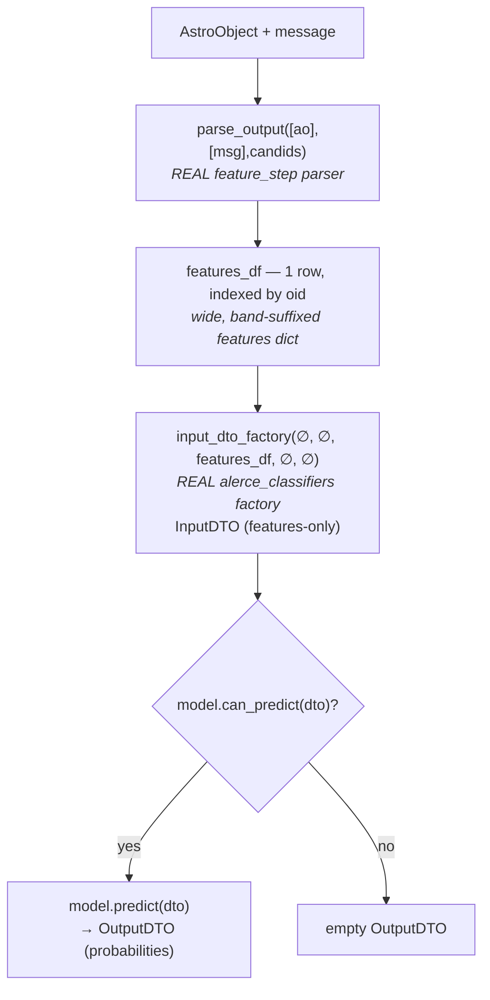

# Offline ZTF features & classification — the flow, formalized

This document pins down **exactly** what the offline pipeline does, end to end:
which objects it runs on, which DB tables/schemas it reads, what it builds, and
how classification works. It is the "what are we actually doing" reference for
`feature_step/features/offline/`.

For module-level docs see [`README.md`](./README.md). For the design rationale
see `docs/superpowers/specs/2026-06-21-offline-ztf-classification-design.md`.

---

## 1. The big picture



<details><summary>Mermaid source</summary>



</details>

Everything inside the `offline/` box is **pure computation reused from the live pipeline**
(`features.utils.parsers`, `lc_classifier`, `alerce_classifiers`, `idmapper`) —
the offline code is glue, not a fork. It replaces only the Kafka consume/produce
plumbing of the streaming `feature_step`.

There are **two terminal outputs** you can stop at:

1. **Features** — `compute_features(...)` → long DataFrame `[name, value, fid, sid, version]`.
2. **Probabilities** — `classify_oid(...)` → `OutputDTO` (top + hierarchical class probabilities).

---

## 2. Which objects? (oid selection)

The offline pipeline is fundamentally **per-oid**. An oid here is the
**multisurvey `bigint` oid** (the `idmapper` encoding of a ZTF string oid, e.g.
`36028941624528297` ↔ `ZTF17aaabauy`).

There are three ways an oid enters the flow:

| Entry point | How the oid(s) are chosen |
|---|---|
| `offline_compute_features.py --oid <bigint>` | A **single** oid, supplied on the CLI. |
| `offline_classify.py --oid <bigint>` | A **single** oid, supplied on the CLI. |
| `offline_compare_vs_alerce.py --oid <bigint\|ZTFstr>` | A **single** oid; accepts either the bigint or the ZTF string and resolves both via `idmapper` (`decode_masterid` / `catalog_oid_to_masterid`). |
| `offline_benchmark_features.py --n N --min-det M` | A **sample/subset**: the only place a set of oids is selected from the DB (see below). |

The **only** subset-selection query lives in the benchmark script
(`offline_benchmark_features.py::_select_oids`):

```sql
SELECT oid, n_det FROM multisurvey_ztf.object
WHERE sid = 0 AND n_det >= :min_det
ORDER BY oid LIMIT :n
```

i.e. "the first N ZTF objects (by oid order) with at least `min_det` detections."
This is **only for benchmarking** — there is no production "select a cohort"
step. Real batch use would feed an external oid list one at a time.

A `min_detections` gate (default 1) is applied **after** fetch, inside
`_prepare_detections`: if an object has fewer than `min_detections` **real**
(non-forced) detections, the whole object returns `None` and is skipped.

---

## 3. Which DB? Schemas and tables

Connection comes from a credentials JSON (`{user, password, host, dbname}`) via
`db._make_engine` → `postgresql+psycopg2`. Everything is read-only.

### 3a. `multisurvey_ztf` schema — the feature-computation inputs

`SCHEMA = "multisurvey_ztf"` in `db.py` (override via the `OFFLINE_DB_SCHEMA`
env var). This is the real/backfilled ZTF dataset; plain `multisurvey` was a short
~3-month slice (see §7). `SID = 0` (ZTF, per `multisurvey_ztf.sid_lut`) filters
every query.

| Reader (`db.py`) | Tables (join) | Grain | Key columns read (→ parser name) |
|---|---|---|---|
| `fetch_detections` | `multisurvey_ztf.detection` ⋈ `multisurvey_ztf.ztf_detection` on `(oid, measurement_id)` | one row / detection | `mjd, ra, dec, band, magpsf→mag, sigmapsf→e_mag, magpsf_corr→mag_corr, sigmapsf_corr_ext→e_mag_corr_ext, isdiffpos, distnr, rb, rfid` |
| `fetch_forced_photometry` | `multisurvey_ztf.forced_photometry` ⋈ `multisurvey_ztf.ztf_forced_photometry` on `(oid, measurement_id)` | one row / forced epoch | `mjd, ra, dec, band, mag, e_mag, mag_corr, e_mag_corr_ext, isdiffpos, procstatus, distnr, rfid, sharpnr, chinr` |
| `fetch_ps1` | `multisurvey_ztf.ztf_ps1` | one row / oid (`DISTINCT ON (oid) ORDER BY oid, measurement_id` → earliest) | `sgscore1, sgmag1, srmag1, simag1, szmag1, distpsnr1` |
| `fetch_allwise` | `multisurvey_ztf.xmatch` ⋈ `multisurvey_ztf.allwise` on `oid_catalog` | one row / oid (`DISTINCT ON (oid) ORDER BY oid, dist` → nearest) | `w1mpro→W1, w2mpro→W2, w3mpro→W3, w4mpro→W4`; filtered `sid=0 AND catid=0` (AllWISE, per `catalog_id_lut`) |
| `fetch_references` | `multisurvey_ztf.ztf_reference` | rows / oid | `rfid, sharpnr, chinr`; filtered `chinr >= 0` (production validity filter) |

Post-read normalization (`_postprocess_epochs`): `band` integers are validated
against `{1:g, 2:r, 3:i}`, and `isdiffpos` is normalized to `±1` ints
(`normalize_isdiffpos`).

`multisurvey_ztf.object` is read **only** by the benchmark's oid selector (§2).

> AllWISE and references are **not** in the message — the magstats output schema
> has no xmatch field. They're fetched separately and passed alongside the
> message into `compute_features`.

#### Why we read AllWISE from the DB instead of calling the xmatch API

The live `feature_step` (`features/step.py`) can obtain the AllWISE crossmatch two
different ways, and **we deliberately use neither's network path** here:

- **Live path (`USE_XMATCH=true`, used for LSST).** `pre_execute` calls the
  **xmatch microservice** through `libs/xmatch_client` —
  `XmatchClient.conesearch_with_metadata(ras, decs, oids)` does a *positional cone
  search* (POST `v1/bulk-conesearch`) and a metadata fetch (POST `v1/bulk-metadata`),
  attaches the result to `msg['xmatches']`, **and produces it back to the scribe**
  so it lands in `multisurvey.xmatch`. LSST objects arrive *without* a stored
  crossmatch, so the step has to compute one live; it can't read what isn't there
  yet.
- **Offline path (here, ZTF).** For ZTF that crossmatch **already exists in the
  DB** (`multisurvey_ztf.xmatch ⋈ multisurvey_ztf.allwise`), persisted upstream. So
  `fetch_allwise` just reads the precomputed row — same `{metadata: {w1mpro…}}`
  shape the parser expects, no service call.

We read directly from the DB because:

1. **The match already exists for ZTF** — recomputing it via the API would be
   redundant work and would hit the network for every oid.
2. **Determinism / reproducibility.** Offline runs (backfills, benchmarks,
   `compare_vs_alerce`) should reproduce exactly what the stored crossmatch was,
   not a fresh cone search whose result can drift with catalog/service changes.
3. **No side effects.** The offline tooling is strictly read-only; the live API
   path also *writes* matches back via the scribe, which is not something a
   recompute/validation run should do.
4. **No service dependency.** Batch/offline use shouldn't require the xmatch
   microservice to be up and reachable.

If a ZTF oid has no stored AllWISE row, `_xmatches` returns `None` and the parser
falls back to `W1–W4 = NaN` (same as the live behavior when there's no match) — we
do **not** fall back to calling the API.

### 3b. `alerce` schema — validation reference only (not part of compute)

Used **only** by `offline_compare_vs_alerce.py` to diff our features against the
legacy stored ones. Not touched by feature computation or classification.

| Reader | Table | Purpose |
|---|---|---|
| `fetch_alerce_features` | `alerce.feature` | stored legacy features for a ZTF **string** oid; `[name, value, fid, version]`. Optionally filtered by `version`. |
| `list_alerce_feature_versions` | `alerce.feature` | distinct `version` strings stored for an oid (no timestamp column exists). |
| `_fetch_alerce_lc_span` (in script) | `alerce.object` | `firstmjd, lastmjd, ndet` — LC-span context for the comparison printout. |

### 3c. `multisurvey_ztf.probability` — stamp classifiers only (no stored LC probs)

Explored 2026-06-24. The table **exists** but holds only **stamp-classifier**
output — **not** the BHRF/Squidward lightcurve classifier. So there is nothing
here to diff our predicted LC probabilities against.

- **Hash-partitioned** into `probability_part_0 … probability_part_15`. It is
  large — **never full-scan / `GROUP BY` it**. Always filter by `oid` (prunes to
  one partition and hits the PK index); add a `LIMIT` and a `statement_timeout`.
- Columns: `oid(bigint), sid(smallint), classifier_id(smallint),
  classifier_version(smallint), class_id(smallint), probability(real),
  ranking(smallint), lastmjd(double)`.
- `classifier_id` → `multisurvey_ztf.classifier`, `class_id` →
  `multisurvey_ztf.taxonomy` (see §3d). The four classifiers currently present:

  | classifier_id | classifier_name | version | classes |
  |---|---|---|---|
  | 1 | `stamp_classifier_rubin` | 2.0.1 | SN/AGN/VS/asteroid/bogus |
  | 2 | `stamp_classifier_2025_beta` | 2.1.1 | + satellite |
  | 3 | `stamp_classifier_rubin_beta_20260421` | 2.0.2 | SN/AGN/VS/asteroid/bogus |
  | 4 | `stamp_classifier_ztf` | 1.0.4 | + satellite |

- `probability.classifier_version` is a **smallint** that appears to encode the
  `classifier.classifier_version` string with the dots stripped
  (`2.1.1` → `211`, `1.0.4` → `104`).
- **Consequence:** the predicted-vs-stored BHRF compare has **no counterpart in
  this table** — these are stamp probabilities with a flat 5–6 class taxonomy,
  not the BHRF lightcurve taxonomy. `fetch_stored_probabilities` stays
  `NotImplementedError` and `offline_compare_probabilities.py` stays a stub;
  comparing against these rows would be apples-to-oranges.

### 3d. DB metadata we must populate (LUTs) — **manual, our responsibility**

For ZTF features + the BHRF LC classifier to have a home in the DB, three lookup
tables must be filled for **ZTF (`sid = 0`, `tid = 0`)**. These are seeded — and
must be edited — in the schema-authority library, not by the offline tooling:

- **Authority file:** `libs/db-plugins-multisurvey/db_plugins/db/sql/_initial_data_pipeline.py`
  (`INITIAL_DATA`), applied by `_connection_pipeline.py::insert_initial_data` as
  `INSERT … ON CONFLICT DO NOTHING`. **Idempotent: it inserts new rows but never
  updates existing ones.**
- **Drift warning:** the live DB already has `classifier` ids **3 and 4** that
  are *absent* from this checkout's seed file (which stops at id 2 / taxonomy
  classifier_id 3). The live DB is ahead of this checkout. **Rebase on the latest
  db-plugins and reconcile before editing**, or you'll renumber over real ids.

| LUT | PK (`index_elements`) | Current state | What to add (manual) |
|---|---|---|---|
| `feature_name_lut` | `(feature_id, sid)` | 146 rows, **all `sid = 1` (LSST)**; zero ZTF | ZTF rows with `sid = 0, tid = 0`. `feature_id` is namespaced by `sid`, so it can restart at 0. `feature_name` is the **band-less** name (band lives in `feature.band`). |
| `classifier` | `(classifier_id)` | ids 1–4, all **stamp** | The BHRF LC classifier: `classifier_id` = next free (live max is 4 → **5**), `classifier_name = lc_classifier_BHRF_forced_phot` (deployment tag, see §6), `classifier_version = "2.1.0"`, `tid = 0`. |
| `taxonomy` | `(class_id, classifier_id)` | flat stamp taxonomy only | The BHRF class rows for the new `classifier_id`: `(class_id, class_name, order)`. The table has **no hierarchy column** — BHRF's hierarchical taxonomy must be flattened; decide how top vs. leaf classes are represented. |

Also note: **`feature_version_lut` is empty (0 rows).** `feature.version` is a
smallint FK into it, so a ZTF feature-version row is needed before any ZTF
`feature` rows can be written.

> The exact **ZTF feature-name list** is not enumerated here: derive it from the
> distinct `name` values of a real `compute_features(...)` run (§5) — the LSST
> `feature_name_lut` set is *not* reusable as-is.

---

## 4. Build the message (`message.py`)

`build_message(oid, detections, forced, ps1)` assembles the **magstats_ms_step
ZTF output message** — the exact contract `feature_step` consumes from magstats
(`schemas/magstats_ms_step/ztf/output.avsc`, the `magstats_ms_ztf` record).
Key facts:

- Detections **and** forced photometry both go into the single `detections`
  array; forced epochs carry `forced=True` (there is no separate forced array).
- Per-epoch aux fields go into each alert's `extra_fields` map:
  - detections: `rb, distnr, rfid` + PS1 keys (`sgscore1, sgmag1, srmag1, simag1, szmag1, distpsnr1`).
  - forced: `procstatus, distnr, rfid, sharpnr, chinr`.
- `mag_corr is not None` sets `corrected`; `has_stamp = not forced`.
- Rows are iterated via `to_dict("records")` (never `iterrows`) so big
  `oid`/`measurement_id` ints aren't corrupted by float64 unification.

---

## 5. Compute features (`lc_features.py`)

This is the pure body of the streaming step, minus Kafka/scribe:



<details><summary>Mermaid source</summary>



</details>

- `_prepare_detections` drops bogus epochs, enforces the min-real-detections
  gate, and adds `aid = oid` + `index_column = "{measurement_id}_{oid}"` (the
  message has no `aid`).
- All epochs enter through the parser's `detections` arg; the **`forced` arg is
  empty `[]`** — the per-row `forced` flag is what routes forced epochs. (This is
  one of the parser fixes this branch relies on; see README §"Fixes this relies on".)
- AllWISE is reshaped by `_xmatches` into the `{allwise:{}, metadata:{w1mpro…}}`
  shape the parser reads; `None` when no match (→ W1–W4 NaN).
- `compute_astro_object` returns the post-extract `AstroObject` (so classify can
  reuse it without recomputing); `compute_features` returns just `ao.features`.
- `compute_db_features` is the **DB-ready** output: it runs the same compute,
  then applies the production save rules via `prepare_ao_features_for_db`
  (drop NaN, `fid→band` code, `name→feature_id` via the LUT) and attaches
  `oid, sid=0, version`. Result columns match the `feature` table exactly:
  `[oid, sid, feature_id, band, version, value]`. The `feature_id`/`version`
  maps come from the **local fixture** `offline/feature_lut.py` (the DB ZTF
  `feature_name_lut`/`feature_version_lut` are still empty — §3d); fixture ids
  are offline's own until that LUT is seeded. `version` is the single
  `feature-step` package version, falling back to the fixture's pinned version
  when the package isn't installed (offline-from-source runs). `compute_features`
  keeps the named, NaN-inclusive frame for `classify.py` / `compare_vs_alerce`.
- The extractor/preprocessor are injectable and built lazily (the extractor is
  heavy — build once, reuse across oids in batch).

---

## 6. Classify (`classify.py`)

Only when you want probabilities. Reuses real pipeline + `alerce_classifiers`
code; **drops the `lc_classification` step entirely** (its candid-based schema is
incompatible with v11 messages, and the Squidward model is features-only).



<details><summary>Mermaid source</summary>



</details>

- Model is loaded by `load_squidward_model()` from the **same env vars the
  deployed step uses**:
  - `MODEL_PATH` (**required**) — model pickle URL/path, e.g. the S3 BHRF 2.1.0 url.
  - `MAPPER_CLASS` (optional) — defaults to `SquidwardMapper`.
  - `CLASSIFIER_NAME` (optional) — output label; deployment tags `lc_classifier_BHRF_forced_phot`.
  - Version is derived by the model from the path (`.../squidward/2.1.0/...` → `2.1.0`).
- Model: `SquidwardFeaturesClassifier` (BHRF, `lc_classifier_BHRF_forced_phot`, v2.1.0).
- `classify_oid(oid, credentials, model)` is the full DB→probabilities convenience path.

---

## 7. Status — what's done vs. pending

**Done & working:**
- Now reading the full **`multisurvey_ztf`** dataset (switched 2026-06-23 once
  `readonly_user` was granted `SELECT`); plain `multisurvey` was a ~3-month slice.
- DB → message → features end-to-end on real objects (`offline_compute_features.py`),
  verified against `multisurvey_ztf`.
- DB → features → BHRF probabilities end-to-end (`offline_classify.py`, needs `MODEL_PATH`).
- Feature diff tooling vs `alerce.feature` (`offline_compare_vs_alerce.py`).
- Benchmark harness over a sample of oids (`offline_benchmark_features.py`).

**Pending / deferred:**
- **Value-level equality vs `alerce.feature`** — the truncated-LC blocker is now
  **lifted** (we read full-history `multisurvey_ztf` light curves). A clean
  apples-to-apples comparison still needs `--version` matching the deployed
  `lc_classifier`; this has not yet been run/confirmed on the new data.
- **Predicted-vs-stored probability compare** — resolved (negative):
  `multisurvey_ztf.probability` holds **only stamp-classifier** output, not the
  BHRF lightcurve classifier (§3c). There are **no stored LC probabilities** to
  diff against, so `fetch_stored_probabilities` / `offline_compare_probabilities.py`
  stay stubs by design rather than "pending a table name."
- **Populate the ZTF LUTs** — `feature_name_lut` (ZTF feature names),
  `classifier` (the BHRF LC classifier), and `taxonomy` (its classes) have **no
  ZTF/BHRF rows yet**. Filled manually in db-plugins `_initial_data_pipeline.py`
  (§3d). Prerequisite for persisting ZTF features / BHRF probabilities.

---

## 8. File map

| File | Role |
|---|---|
| `db.py` | All SQL readers + schema/SID/catid constants. §3 |
| `message.py` | `build_message` → magstats_ms_step ZTF output message dict. §4 |
| `lc_features.py` | message → AstroObject → features. §5 |
| `classify.py` | features → BHRF probabilities. §6 |
| `feature_compare.py` | pure feature-diff utilities (used by compare script). |
| `feature_lut.py` | Local ZTF feature_name/version LUT fixture + loaders (`load_feature_name_lut`, `version_name_to_id`, `default_version_name`). |
| `scripts/offline_generate_feature_lut.py` | One-off generator that prints the fixture from a real run. |
| `scripts/offline_*.py` | CLI entry points (in `feature_step/scripts/`). §2 |
