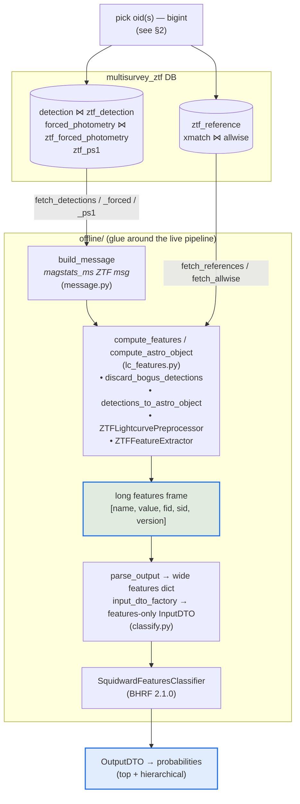
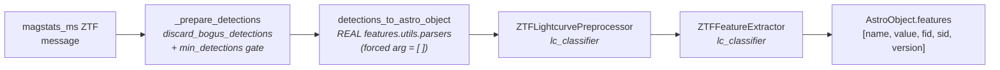
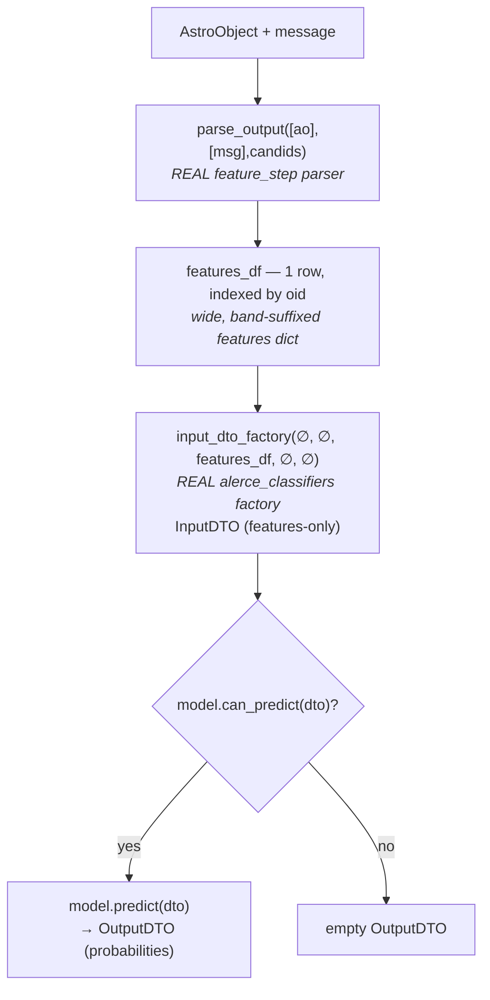

# Offline ZTF features & classification — the flow, formalized

This document pins down **exactly** what the offline pipeline does, end to end:
which objects it runs on, which DB tables/schemas it reads, what it builds, and
how classification works. It is the "what are we actually doing" reference for
`feature_step/features/offline/`.

For module-level docs see [`README.md`](./README.md). For the design rationale
see `docs/superpowers/specs/2026-06-21-offline-ztf-classification-design.md`.

---

## 1. The big picture


<details><summary>Mermaid source</summary>



</details>

Everything inside the `offline/` box is **pure computation reused from the live pipeline**
(`features.utils.parsers`, `lc_classifier`, `alerce_classifiers`, `idmapper`) —
the offline code is glue, not a fork. It replaces only the Kafka consume/produce
plumbing of the streaming `feature_step`.

There are **two terminal outputs** you can stop at:

1. **Features** — `compute_features(...)` → long DataFrame `[name, value, fid, sid, version]`.
2. **Probabilities** — `classify_oid(...)` → `OutputDTO` (top + hierarchical class probabilities).

---

## 2. Which objects? (oid selection)

The offline pipeline is fundamentally **per-oid**. An oid here is the
**multisurvey `bigint` oid** (the `idmapper` encoding of a ZTF string oid, e.g.
`36028941624528297` ↔ `ZTF17aaabauy`).

There are three ways an oid enters the flow:

| Entry point | How the oid(s) are chosen |
|---|---|
| `offline_compute_features.py --oid <bigint>` | A **single** oid, supplied on the CLI. |
| `offline_classify.py --oid <bigint>` | A **single** oid, supplied on the CLI. |
| `offline_compare_vs_alerce.py --oid <bigint\|ZTFstr>` | A **single** oid; accepts either the bigint or the ZTF string and resolves both via `idmapper` (`decode_masterid` / `catalog_oid_to_masterid`). |
| `offline_compare_probabilities.py --oid <bigint\|ZTFstr>` | A **single** oid, resolved the same way; compares BHRF probabilities against `alerce.probability` (§3b). |
| `offline_xmatch_oid.py --oid <bigint\|ZTFstr>` | A **single** oid; crossmatch only (no model needed), optionally persisted to `<schema>.xmatch` (§3a). |
| `offline_benchmark_features.py --n N --min-det M` | A **sample/subset**: the only place a set of oids is selected from the DB (see below). |

The **only** subset-selection query lives in the benchmark script
(`offline_benchmark_features.py::_select_oids`):

```sql
SELECT oid, n_det FROM multisurvey_ztf.object
WHERE sid = 0 AND n_det >= :min_det
ORDER BY oid LIMIT :n
```

i.e. "the first N ZTF objects (by oid order) with at least `min_det` detections."
This is **only for benchmarking** — there is no production "select a cohort"
step. Real batch use would feed an external oid list one at a time.

A `min_detections` gate (default 1) is applied **after** fetch, inside
`_prepare_detections`: if an object has fewer than `min_detections` **real**
(non-forced) detections, the whole object returns `None` and is skipped.

---

## 3. Which DB? Schemas and tables

Connection comes from a credentials JSON (`{user, password, host, dbname}`) via
`db._make_engine` → `postgresql+psycopg2`. Everything is read-only.

### 3a. `multisurvey_ztf` schema — the feature-computation inputs

`SCHEMA = "multisurvey_ztf"` in `db.py` (override via the `OFFLINE_DB_SCHEMA`
env var). This is the real/backfilled ZTF dataset; plain `multisurvey` was a short
~3-month slice (see §7). `SID = 0` (ZTF, per `multisurvey_ztf.sid_lut`) filters
every query.

| Reader (`db.py`) | Tables (join) | Grain | Key columns read (→ parser name) |
|---|---|---|---|
| `fetch_detections` | `multisurvey_ztf.detection` ⋈ `multisurvey_ztf.ztf_detection` on `(oid, measurement_id)` | one row / detection | `mjd, ra, dec, band, magpsf→mag, sigmapsf→e_mag, magpsf_corr→mag_corr, sigmapsf_corr_ext→e_mag_corr_ext, isdiffpos, distnr, rb, rfid` |
| `fetch_forced_photometry` | `multisurvey_ztf.forced_photometry` ⋈ `multisurvey_ztf.ztf_forced_photometry` on `(oid, measurement_id)` | one row / forced epoch | `mjd, ra, dec, band, mag, e_mag, mag_corr, e_mag_corr_ext, isdiffpos, procstatus, distnr, rfid, sharpnr, chinr` |
| `fetch_ps1` | `multisurvey_ztf.ztf_ps1` | one row / oid (`DISTINCT ON (oid) ORDER BY oid, measurement_id` → earliest) | `sgscore1, sgmag1, srmag1, simag1, szmag1, distpsnr1` |
| `fetch_allwise` | `multisurvey_ztf.xmatch` ⋈ `multisurvey_ztf.allwise` on `oid_catalog` | one row / oid (`DISTINCT ON (oid) ORDER BY oid, dist` → nearest) | `w1mpro→W1, w2mpro→W2, w3mpro→W3, w4mpro→W4`; filtered `sid=0 AND catid=0` (AllWISE, per `catalog_id_lut`) |
| `fetch_references` | `multisurvey_ztf.ztf_reference` | rows / oid | `rfid, sharpnr, chinr`; filtered `chinr >= 0` (production validity filter) |

Post-read normalization (`_postprocess_epochs`): `band` integers are validated
against `{1:g, 2:r, 3:i}`, and `isdiffpos` is normalized to `±1` ints
(`normalize_isdiffpos`).

`multisurvey_ztf.object` is read **only** by the benchmark's oid selector (§2).

> AllWISE and references are **not** in the message — the magstats output schema
> has no xmatch field. They're fetched separately and passed alongside the
> message into `compute_features`.

#### AllWISE crossmatch: compute live (like the step) or read from the DB

Computing the AllWISE crossmatch is the **feature step's own responsibility**
(`features/step.py::pre_execute`): with `USE_XMATCH`, it calls the internal
**Xwave** microservice through `libs/xmatch_client`. `step.get_xmatch_info` issues
**one `conesearch_with_metadata(ras, decs, oids, catalog=<name>)` request per
catalog** in `XMATCH_CATALOGS` (default `["allwise","gaia"]`) — a *positional cone
search* (POST `v1/bulk-conesearch`, passing the `catalog` field so the server
scopes that catalog *before* the KNN) + a metadata fetch (POST `v1/bulk-metadata`).
It attaches the allwise match to `msg['xmatches']` (so `detections_to_astro_object`
reads `W1–W4` from `metadata['w{n}mpro']['Float64']`), **and produces the matches
back to the scribe** so they land in `multisurvey_ztf.xmatch`.

The offline path mirrors this (`features/offline/xmatch.py`):

- **Compute-live (preferred).** When an Xwave URL is set (`--xmatch-url` /
  `XMATCH_URL`), `classify._fetch_oid_inputs` calls
  `xmatch.compute_matches([oid], [meanra], [meandec], url)` — which, like
  `get_xmatch_info`, does **one cone search per catalog** (`catalog=<name>`),
  centered on the message's `meanra/meandec` — and
  `matches_to_allwise_df` reduces it to the `[oid, W1, W2, W3, W4]` frame the
  downstream `_xmatches`/`compute_astro_object` path already consumes.
- **DB read (fallback).** With no URL, `fetch_allwise` reads
  `multisurvey_ztf.xmatch ⋈ multisurvey_ztf.allwise`. **These tables are EMPTY for
  ZTF today** (the crossmatch is produced by the feature step, which never ran with
  `USE_XMATCH` for ZTF), so this yields `W1–W4 = NaN` for every object — which
  silently breaks QSO/AGN IR discrimination. The compute-live path exists precisely
  to fix that.

**Persistence differs from the step:** offline does **not** send to the scribe.
It writes the crossmatch straight to the DB instead (`persist_matches`, **implemented**):
`INSERT … ON CONFLICT (oid, sid, catid) DO UPDATE SET oid_catalog, dist, updated_date`,
mirroring the scribe's `XmatchCommand.db_operation`. Dry-run by default — with
`execute=False` it opens no connection and returns `{"executed": False, "would_write": N}`;
`execute=True` upserts every row in one transaction. Rows missing `dist` or
`oid_catalog` are dropped with a warning (both are `NOT NULL`). **Link table only** —
the AllWISE catalog rows in `multisurvey_ztf.allwise` are loaded by a separate
process, not here. Exposed as `offline_classify.py --persist-xmatch` and
`offline_xmatch_oid.py --save` (both need `--execute` + `--write-credentials` to write).

If a ZTF oid has no AllWISE match (either path), `_xmatches` returns `None` and the
parser falls back to `W1–W4 = NaN` — same as the live behavior when there's no match.

### 3b. `alerce` schema — validation reference only (not part of compute)

Used **only** by the compare scripts (`offline_compare_vs_alerce.py` for features,
`offline_compare_probabilities.py` for probabilities) to diff our output against the
legacy stored one. Not touched by feature computation or classification. Everything
here is keyed by the **ZTF string oid**, not the multisurvey bigint.

| Reader | Table | Purpose |
|---|---|---|
| `fetch_alerce_features` | `alerce.feature` | stored legacy features for a ZTF **string** oid; `[name, value, fid, version]`. Optionally filtered by `version`. |
| `list_alerce_feature_versions` | `alerce.feature` | distinct `version` strings stored for an oid (no timestamp column exists). |
| `fetch_stored_probabilities` | `alerce.probability` | stored legacy **BHRF** probabilities for an oid; `[classifier_name, class_name, probability, ranking]`, filtered by `classifier_version` + `classifier_name = ANY(...)`. **This is the LC-classifier counterpart that `multisurvey_ztf.probability` does not have** (§3c). |
| `_fetch_alerce_lc_span` (in script) | `alerce.object` | `firstmjd, lastmjd, ndet` — LC-span context for the comparison printout. |

**`alerce.feature` query cost:** ~7.5B rows and **no index on `version`** — filtering
by version across objects times out. Per-oid reads are fine (PK); population stats
need `TABLESAMPLE`. NaN is stored as `NULL`.

**`alerce.probability` query cost:** ~1.47B rows, **LIST-partitioned by
`classifier_name`**. Always filter `classifier_name = ANY(:names)` — it prunes to
just those partitions, and each partition's PK
`(oid, classifier_name, classifier_version, class_name)` then makes it an index
lookup. Two gotchas: `classifier_name` values are **mixed-case**
(`lc_classifier_BHRF_forced_phot`) even though Postgres lowercases the child *table*
names — pass the column values, not the table names; and `classifier_version` is a
**VARCHAR** here (`'2.1.0'`), unlike the smallint in the multisurvey scheme (§3c).

### 3c. `multisurvey_ztf.probability` — stamp classifiers only (no stored LC probs)

Explored 2026-06-24. The table **exists** but holds only **stamp-classifier**
output — **not** the BHRF/Squidward lightcurve classifier. So there is nothing
here to diff our predicted LC probabilities against.

- **Hash-partitioned** into `probability_part_0 … probability_part_15`. It is
  large — **never full-scan / `GROUP BY` it**. Always filter by `oid` (prunes to
  one partition and hits the PK index); add a `LIMIT` and a `statement_timeout`.
- Columns: `oid(bigint), sid(smallint), classifier_id(smallint),
  classifier_version(smallint), class_id(smallint), probability(real),
  ranking(smallint), lastmjd(double)`.
- `classifier_id` → `multisurvey_ztf.classifier`, `class_id` →
  `multisurvey_ztf.taxonomy` (see §3d). The four classifiers currently present:

  | classifier_id | classifier_name | version | classes |
  |---|---|---|---|
  | 1 | `stamp_classifier_rubin` | 2.0.1 | SN/AGN/VS/asteroid/bogus |
  | 2 | `stamp_classifier_2025_beta` | 2.1.1 | + satellite |
  | 3 | `stamp_classifier_rubin_beta_20260421` | 2.0.2 | SN/AGN/VS/asteroid/bogus |
  | 4 | `stamp_classifier_ztf` | 1.0.4 | + satellite |

- `probability.classifier_version` is a **smallint** that appears to encode the
  `classifier.classifier_version` string with the dots stripped
  (`2.1.1` → `211`, `1.0.4` → `104`).
- **Consequence:** the predicted-vs-stored BHRF compare has **no counterpart in
  this table** — these are stamp probabilities with a flat 5–6 class taxonomy,
  not the BHRF lightcurve taxonomy. Comparing against these rows would be
  apples-to-oranges.
- **Where the stored BHRF probabilities actually live: `alerce.probability`**
  (the *legacy* schema, §3b) — found 2026-07-06. That closes the compare:
  `db.fetch_stored_probabilities` + `probability_compare.py` +
  `offline_compare_probabilities.py` are implemented, no longer stubs. The join is
  a straight `(classifier_name, class_name)` match — same model on both sides, so
  the class strings agree and **no class_id mapping is involved**.
- **We now write** our own BHRF lightcurve probabilities into this same table
  (distinct from the stamp rows already present) via `probability_writer.py`,
  mapping class names → `class_id` through the seeded `taxonomy` (§3d). This is
  writing our own predictions, not comparing against pre-existing ones.

### 3d. DB metadata we must populate (LUTs) — **manual, our responsibility**

For ZTF features + the BHRF LC classifier to have a home in the DB, three lookup
tables must be filled for **ZTF (`sid = 0`, `tid = 0`)**. These are seeded — and
must be edited — in the schema-authority library, not by the offline tooling:

- **Authority file:** `libs/db-plugins-multisurvey/db_plugins/db/sql/_initial_data_pipeline.py`
  (`INITIAL_DATA`), applied by `_connection_pipeline.py::insert_initial_data` as
  `INSERT … ON CONFLICT DO NOTHING`. **Idempotent: it inserts new rows but never
  updates existing ones.**
- **Drift warning:** the live DB already has `classifier` ids **3 and 4** that
  are *absent* from this checkout's seed file (which stops at id 2 / taxonomy
  classifier_id 3). The live DB is ahead of this checkout. **Rebase on the latest
  db-plugins and reconcile before editing**, or you'll renumber over real ids.
- **Back-port pending:** the ZTF **feature** LUT rows below were seeded
  **directly** into the live DB via `ztf_feature_luts_seed.sql`, *not* through
  `_initial_data_pipeline.py`. They must be back-ported into `INITIAL_DATA` so
  fresh deploys / other environments match — until then the live DB is ahead of
  the authority file for ZTF features as well.

| LUT | PK (`index_elements`) | Current state | What's left |
|---|---|---|---|
| `feature_name_lut` | `(feature_id, sid)` | **127 ZTF rows seeded** (`sid = 0, tid = 0`, `feature_id` 0–126) alongside the prior 146 LSST `sid = 1` rows | **Done** — seeded via `ztf_feature_luts_seed.sql`, re-derived in **extractor emission order** and including the 4 `*_mjd_ref` reference-epoch features. Band-less names (`feature_id` namespaced by `sid`, restarts at 0; band lives in `feature.band`). Back-port to authority file pending. |
| `feature_version_lut` | `(version_id, sid)` | **1 ZTF row seeded** (`version_id = 0`, `version_name = 27.5.7a31`, `sid = 0, tid = 0`) | **Done** — same seed file. `version_id = 0` matches the fixture; production's `get_or_create` starts at 1 — adopting that means changing **both** the SQL and `FEATURE_VERSION_LUT`. |
| `classifier` | `(classifier_id)` | ids 1–4 stamp **+ ids 5–9 BHRF** (flat + top + 3 branches, `classifier_version = "2.1.0"`, `tid = 0`) | **Done** — seeded via `ztf_classifier_taxonomy_seed.sql`. Back-port to authority file pending. |
| `taxonomy` | `(class_id, classifier_id)` | flat stamp taxonomy **+ 45 BHRF rows** (21+3+6+6+9; `class_id` per-classifier 0-indexed, `order = class_id`; transient uses **`SESN`**) | **Done** — same seed file. Back-port pending. |

> The **ZTF feature-name list** is captured in `offline/feature_lut.py` (the
> 127-name fixture) and in `ztf_feature_luts_seed.sql` — both generated from a real
> `compute_features(...)` run (§5). The LSST `feature_name_lut` set is *not*
> reusable as-is.

#### The DB is the authority; the fixtures are only bootstrap

`classifier_taxonomy_lut.py` and `feature_lut.py` are **seed fixtures, not runtime
lookups**. The rule:

- **At runtime, ids come from the DB.** `probability_writer` resolves
  `class_name -> class_id` through `db.fetch_taxonomy_maps` (reading
  `<schema>.taxonomy`), never through `TAXONOMY_LUT`. A wrong or stale fixture
  cannot corrupt a written `class_id`.
- **The fixtures exist for the chicken-and-egg cases only:** (a) generating the
  seed SQL that *creates* those rows — you cannot read rows that do not exist yet;
  (b) `scripts/offline_verify_taxonomy.py`, where the fixture's value *is* being an
  independent copy checked against the deployed pickle; (c) unit tests, which stub
  what the DB would return without needing a DB.
- **Prefer `classifier_name` over `classifier_id` as the stable key.** The ids are
  assigned by hand and differ per environment (see the drift warning above), while
  the names are model-derived and stable. Code that hardcodes "BHRF flat is
  classifier_id 5" breaks silently in an environment where 5 is something else;
  code that resolves `classifier_name -> classifier_id` against `<schema>.classifier`
  does not care what the id is.
  ⚠ `probability_compare.py` currently derives its `classifier_id -> classifier_name`
  map from the `CLASSIFIER_LUT` fixture — the one runtime spot that still violates
  this. It is benign today (it only labels output heads and matches on the *name*
  against `alerce.probability`), but it should read `<schema>.classifier` instead.

---

## 4. Build the message (`message.py`)

`build_message(oid, detections, forced, ps1)` assembles the **magstats_ms_step
ZTF output message** — the exact contract `feature_step` consumes from magstats
(`schemas/magstats_ms_step/ztf/output.avsc`, the `magstats_ms_ztf` record).
Key facts:

- Detections **and** forced photometry both go into the single `detections`
  array; forced epochs carry `forced=True` (there is no separate forced array).
- Per-epoch aux fields go into each alert's `extra_fields` map:
  - detections: `rb, distnr, rfid` + PS1 keys (`sgscore1, sgmag1, srmag1, simag1, szmag1, distpsnr1`).
  - forced: `procstatus, distnr, rfid, sharpnr, chinr`.
- `mag_corr is not None` sets `corrected`; `has_stamp = not forced`.
- Rows are iterated via `to_dict("records")` (never `iterrows`) so big
  `oid`/`measurement_id` ints aren't corrupted by float64 unification.

---

## 5. Compute features (`lc_features.py`)

This is the pure body of the streaming step, minus Kafka/scribe:


<details><summary>Mermaid source</summary>



</details>

- `_prepare_detections` drops bogus epochs, enforces the min-real-detections
  gate, and adds `aid = oid` + `index_column = "{measurement_id}_{oid}"` (the
  message has no `aid`).
- All epochs enter through the parser's `detections` arg; the **`forced` arg is
  empty `[]`** — the per-row `forced` flag is what routes forced epochs. (This is
  one of the parser fixes this branch relies on; see README §"Fixes this relies on".)
- AllWISE is reshaped by `_xmatches` into the `{allwise:{}, metadata:{w1mpro…}}`
  shape the parser reads; `None` when no match (→ W1–W4 NaN).
- `compute_astro_object` returns the post-extract `AstroObject` (so classify can
  reuse it without recomputing); `compute_features` returns just `ao.features`.
- `compute_db_features` is the **DB-ready** output: it runs the same compute,
  then applies the production save rules via `prepare_ao_features_for_db`
  (drop NaN, `fid→band` code, `name→feature_id` via the LUT) and attaches
  `oid, sid=0, version`. Result columns match the `feature` table exactly:
  `[oid, sid, feature_id, band, version, value]`. The `feature_id`/`version`
  maps come from the **local fixture** `offline/feature_lut.py` (the DB ZTF
  `feature_name_lut`/`feature_version_lut` are still empty — §3d); fixture ids
  are offline's own until that LUT is seeded. `version` is the single
  `feature-step` package version, falling back to the fixture's pinned version
  when the package isn't installed (offline-from-source runs). `compute_features`
  keeps the named, NaN-inclusive frame for `classify.py` / `compare_vs_alerce`.
- `feature_writer.write_features(rows, credentials, schema=db.SCHEMA, execute=False)`
  persists those DB-ready rows into `<schema>.feature` via
  `ON CONFLICT (oid, sid, feature_id, band) DO UPDATE` (refresh value/version/
  updated_date — matches production's scribe upsert). Dry-run by default; it opens
  no DB connection unless `execute=True`. Exposed as
  `offline_compute_features.py --save` (`--execute` + `--write-credentials` to
  actually write; the default credentials are read-only).
- The extractor/preprocessor are injectable and built lazily (the extractor is
  heavy — build once, reuse across oids in batch).

---

## 6. Classify (`classify.py`)

Only when you want probabilities. Reuses real pipeline + `alerce_classifiers`
code; **drops the `lc_classification` step entirely** (its candid-based schema is
incompatible with v11 messages, and the Squidward model is features-only).


<details><summary>Mermaid source</summary>



</details>

- Model is loaded by `load_squidward_model()` from the **same env vars the
  deployed step uses**:
  - `MODEL_PATH` (**required**) — model pickle URL/path, e.g. the S3 BHRF 2.1.0 url.
  - `MAPPER_CLASS` (optional) — defaults to `SquidwardMapper`.
  - `CLASSIFIER_NAME` (optional) — output label; deployment tags `lc_classifier_BHRF_forced_phot`.
  - Version is derived by the model from the path (`.../squidward/2.1.0/...` → `2.1.0`).
- Model: `SquidwardFeaturesClassifier` (BHRF, `lc_classifier_BHRF_forced_phot`, v2.1.0).
- `classify_oid(oid, credentials, model)` is the full DB→probabilities convenience path.
- **Feature coverage — verified.** `classify_batch` does `features[self.feature_list]`
  (a *strict* column selection over the model's 199 band-suffixed names), so a
  single missing feature is a hard **`KeyError`** at predict time, not a silent
  degrade. `scripts/offline_verify_model_features.py` confirms the offline pipeline
  emits all 199 (see §7 Done). The offline extractor produces **209** columns —
  the 199 the model consumes plus 10 unused fit-reference params
  (`TDE_mag0`, `fleet_m0`, `fleet_t0`, `ulens_mag0`, `ulens_t0`, each × g/r) that
  `feature_list` selection drops.

---

## 7. Status — what's done vs. pending

**Done & working:**
- Now reading the full **`multisurvey_ztf`** dataset (switched 2026-06-23 once
  `readonly_user` was granted `SELECT`); plain `multisurvey` was a ~3-month slice.
- DB → message → features end-to-end on real objects (`offline_compute_features.py`),
  verified against `multisurvey_ztf`.
- DB → features → BHRF probabilities end-to-end (`offline_classify.py`, needs `MODEL_PATH`).
- Feature diff tooling vs `alerce.feature` (`offline_compare_vs_alerce.py`).
- Benchmark harness over a sample of oids (`offline_benchmark_features.py`).
- **ZTF feature LUTs seeded** (`feature_name_lut` 127 rows + `feature_version_lut`
  1 row) via `ztf_feature_luts_seed.sql`, and **feature persistence** into
  `multisurvey_ztf.feature` (`feature_writer` / `offline_compute_features.py --save`).
  ⚠ seeded directly, not yet back-ported to the db-plugins authority file (§3d).
- **Offline features cover the model's 199** — verified 2026-07-02 by
  `scripts/offline_verify_model_features.py` over 9 diverse oids (dense / sparse /
  forced-heavy + the LUT oid): name-diff **PASS** (0 missing for every oid), and
  `--smoke` loaded the md5-verified deployed model and confirmed `model.predict`
  runs without `KeyError` on all 9, with the loaded `feature_list` matching the
  pinned `MODEL_FEATURE_LIST`. Hard prerequisite for BHRF classification (§6).
  ⚠ The sample is a fixed handful (`SAMPLE_OIDS`); a feature computed only for
  light-curve shapes outside those 9 wouldn't be caught until the sample is
  refreshed (re-run the discovery step / pass `--oid`).
- **BHRF `classifier` + `taxonomy` LUTs seeded** (5 classifier rows ids 5–9 +
  45 taxonomy rows) via `ztf_classifier_taxonomy_seed.sql`, generated from the
  `classifier_taxonomy_lut.py` fixture and cross-checked against the deployed
  pickle (`scripts/offline_verify_taxonomy.py`). Class names locked to **`SESN`**.
  ⚠ seeded directly, not yet back-ported to the db-plugins authority file (§3d).
- **BHRF probabilities persist to `multisurvey_ztf.probability`** via
  `probability_writer.py` (`offline_classify.py --save`): one row per class per
  classifier across all 5 seeded classifiers (ids 5–9). `class_name→class_id` read
  from the **DB `taxonomy`** (`db.fetch_taxonomy_maps`, the authority — not the
  fixture); `classifier_version` smallint (`2.1.0`→`210`); `ranking` =
  per-classifier dense rank desc; `lastmjd` = max MJD over detections+forced
  (already MJD, no JD subtraction); upsert `ON CONFLICT (oid, sid, classifier_id,
  class_id) DO UPDATE`. Dry-run by default.
- **Per-catalog crossmatch — the AllWISE-drop bug is fixed.** `libs/xmatch_client`
  now forwards a `catalog` argument to `v1/bulk-conesearch`, so the server scopes
  the search to one catalog *before* the KNN. Both the live step
  (`step.get_xmatch_info`, over `XMATCH_CATALOGS`, default `["allwise","gaia"]`)
  and offline (`xmatch.compute_matches`) issue **one request per catalog**.
  Previously the single global `nneighbor=1` returned only the overall nearest
  match, silently hiding AllWISE whenever a co-located Gaia source was closer.
  See `XMATCH_NNEIGHBOR_NOTE.md`.
- **Crossmatch persistence** into `<schema>.xmatch` (`persist_matches`), §3a.
- **Predicted-vs-stored probability compare** — implemented against the *legacy*
  `alerce.probability` (§3b/§3c): `db.fetch_stored_probabilities` +
  `probability_compare.py` + `offline_compare_probabilities.py`. Joins on
  `(classifier_name, class_name)` across all 5 BHRF heads and reports per-head
  rank-1 agreement.
- **End-to-end validation vs the legacy production pipeline** —
  see **`OFFLINE_VS_LEGACY_VALIDATION.md`**. On the 559 OIDs provably classified
  with feature version 27.5.6, the offline pipeline reproduces the production BHRF
  **final class for 554/559 = 99.1%** (all 5 heads: 89.4%), and the live-Xwave
  AllWISE crossmatch matches the stored WISE colors **75/75** (|Δ| ≈ 1e-6). The 5
  disagreements are single borderline neighbor flips. Two must-dos are documented
  there: **truncate the LC** to the 27.5.6 epoch, and load the model from a **local
  md5-verified path** (a URL `MODEL_PATH` silently reuses a stale SNIbc pickle in
  `/tmp/SquidwardFeaturesClassifier/`).
- **Production finding: recent feature versions have no AllWISE** — see
  **`WISE_NULL_CLASSIFICATION_IMPACT.md`**. `27.5.7a32.dev1` is 100% NaN in the 11
  WISE colors, which biases BHRF toward Stochastic: stored predictions dropped from
  71.5% to 36.8% Periodic across the ~Oct–Nov 2025 rollover, and a controlled
  ablation (blank only WISE) reproduces that value (87% → 37.2%). The missing WISE
  is **86% recoverable** with our xmatch client at 1.005″.

**Pending / deferred:**
- **Why `27.5.7a32.dev1` has no AllWISE at all** — still undetermined. The data
  exists (86% recoverable), so it is a pipeline/enrichment gap, not absent
  counterparts.
- **Attribution by reconstruction for the WISE note** — the class-composition
  argument leans on the `lastmjd` proxy. The direct confirmation (feed each object's
  `27.5.6` *and* `dev1` vector to BHRF and see which reproduces the stored
  prediction) has not been run.
- **Feature-value equality is characterized, not "clean"** — with the LC matched,
  the residual differences are understood and split three ways
  (`OFFLINE_VS_LEGACY_VALIDATION.md` §5): non-convex fits and period-derived
  quantities (irreproducible by nature), **input provenance** — reprocessed forced
  photometry (`procstatus` 61→0), `distpsnr1`, reference values — and a matched
  core (WISE colors, `Mean`, coordinates). The provenance group is the only
  systematic one; `offline_forced_swap_experiment.py` isolates the forced-photometry
  half of it.
- **`probability_compare.py` should read `<schema>.classifier`** instead of the
  `CLASSIFIER_LUT` fixture for its `classifier_id -> classifier_name` map (§3d).
- **Back-port every seeded LUT row to the authority file** (§3d). We seeded the
  live DB with raw SQL, bypassing
  `libs/db-plugins-multisurvey/db_plugins/db/sql/_initial_data_pipeline.py`, so the
  authority file and the live DB have diverged:

  | | live DB | `INITIAL_DATA` |
  |---|---|---|
  | `feature_name_lut` ZTF (`sid = 0`) | 127 rows | **0** (only the 146 LSST `sid = 1` rows) |
  | `classifier` | ids 1–4 stamp + **5–9 BHRF** | stops at **id 2** |
  | `taxonomy` BHRF | 45 rows | **0** (its stamp rows already reference a `classifier_id 3` absent from its own `classifier` block) |

  Two consequences: a **fresh deploy or staging DB comes up without the ZTF LUTs**,
  so `feature_writer` / `probability_writer` fail there on the FK; and the file no
  longer describes reality.

  **The renumbering hazard — why order matters.** `classifier_id` is assigned by
  hand in that list. This checkout ends at id 2, so "just continuing the list" would
  make BHRF flat `classifier_id = 3` — but in the live DB 3 is already a stamp
  classifier. Since the insert is `ON CONFLICT (classifier_id) DO NOTHING`, applying
  that file to the live DB would **silently do nothing** (3 stays the stamp
  classifier) while a fresh DB would get 3 = BHRF flat: the same id means different
  things per environment, and `probability` rows keyed on it become ambiguous.
  **Therefore: first rebase db-plugins so it carries the real ids 3–4 and verify
  against live, only then append 5–9 and the ZTF `feature_name_lut` /
  `feature_version_lut` rows.** The offline code itself should not depend on the
  outcome — it resolves ids from the DB (§3d).

---

## 8. File map

| File | Role |
|---|---|
| `db.py` | All SQL readers + schema/SID/catid constants. §3 |
| `message.py` | `build_message` → magstats_ms_step ZTF output message dict. §4 |
| `lc_features.py` | message → AstroObject → features. §5 |
| `classify.py` | features → BHRF probabilities. §6 |
| `feature_compare.py` | pure feature-diff utilities (used by compare script). Canonicalizes names (`/`→`_`) so the legacy `Power_rate_1/2` and the extractor's `Power_rate_1_2` join as one feature. |
| `probability_compare.py` | pure probability-diff utilities: BHRF `OutputDTO` → per-head series, joined against `alerce.probability` rows on `(classifier_name, class_name)`. §3b |
| `xmatch.py` | Live AllWISE crossmatch via Xwave (`compute_matches`, one request per catalog), `matches_to_allwise_df`, and the `<schema>.xmatch` upsert (`persist_matches`). §3a |
| `feature_lut.py` | Local ZTF feature_name/version LUT fixture + loaders (`load_feature_name_lut`, `version_name_to_id`, `default_version_name`). |
| `model_feature_list.py` | Pinned authority: the deployed BHRF's 199 `feature_list` names + md5/version provenance. §6 |
| `classifier_taxonomy_lut.py` | BHRF classifier + taxonomy seed fixture (source of truth) + `render_seed_sql()`. §3d |
| `model_features.py` | Pure coverage logic (`predict_input_columns`, `diff_feature_coverage`) mirroring the model's predict-input namespace. §6 |
| `scripts/offline_verify_model_features.py` | Verifier: name-diff offline features vs the 199 + `--smoke` end-to-end predict check. §6/§7 |
| `feature_writer.py` | Upsert DB-ready feature rows into `<schema>.feature` (`write_features`). §5 |
| `probability_writer.py` | Build + upsert BHRF probability rows into `<schema>.probability` (`build_probability_rows` + `write_probabilities`; class_id via `db.fetch_taxonomy_maps`). §6 |
| `scripts/offline_generate_feature_lut.py` | One-off generator that prints the fixture from a real run. |
| `ztf_feature_luts_seed.sql` | Idempotent SQL seeding the ZTF `feature_name_lut` + `feature_version_lut` (`sid = 0`). §3d |
| `ztf_classifier_taxonomy_seed.sql` | Idempotent SQL seeding the BHRF `classifier` (ids 5–9) + `taxonomy` (45 rows). Generated from `classifier_taxonomy_lut.py`. §3d |
| `scripts/offline_*.py` | CLI entry points (in `feature_step/scripts/`). §2 |
| `OFFLINE_VS_LEGACY_VALIDATION.md` | **Validation report**: how we picked version 27.5.6 and the 559-OID cohort, the 99.1% class reproduction, and where features still differ + why. §7 |
| `WISE_NULL_CLASSIFICATION_IMPACT.md` | **Finding**: recent feature versions have no AllWISE, which biases BHRF toward Stochastic. Evidence = NaN rates + stored-probability timeline + model ablation. §7 |
| `XMATCH_NNEIGHBOR_NOTE.md` | Diagnosis (and now the fix) of the global-`nneighbor=1` bug that hid AllWISE behind a nearer Gaia match. §3a |
| `nan_distribution/`, `wise_ablation/`, `class_over_time/` | The scripts + CSVs + figures backing `WISE_NULL_CLASSIFICATION_IMPACT.md` (each has its own README). |
