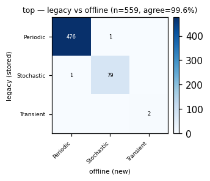
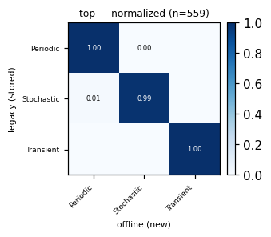
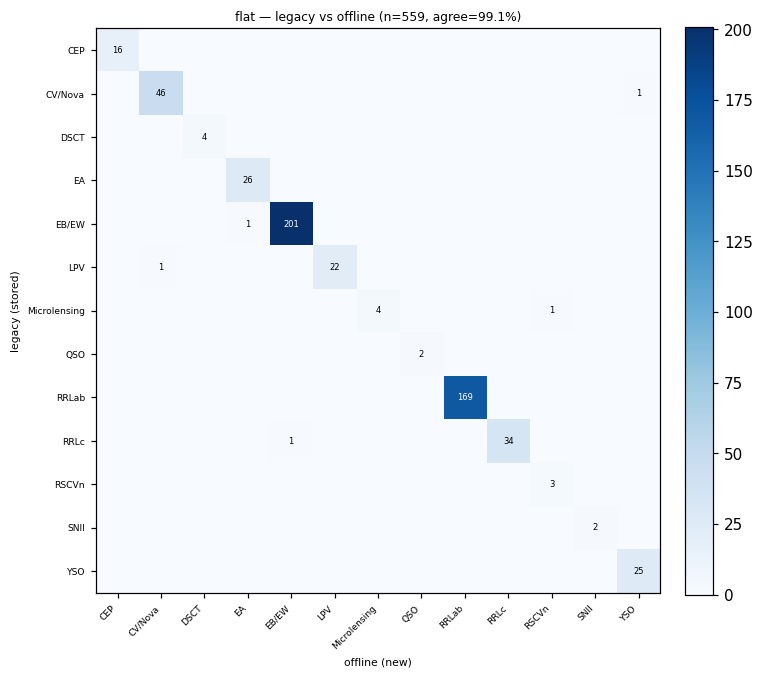
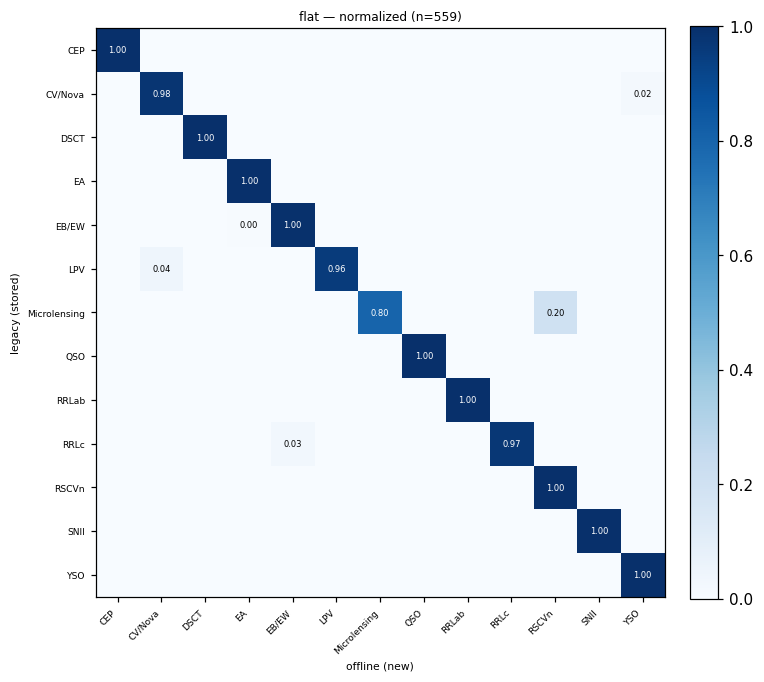
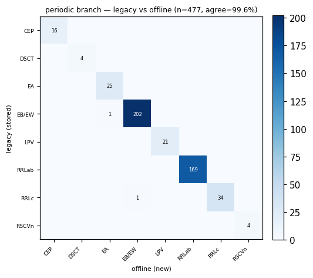
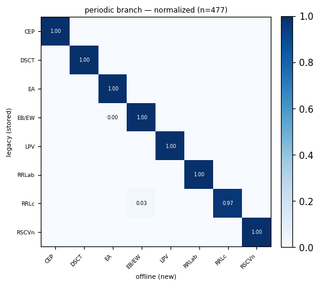
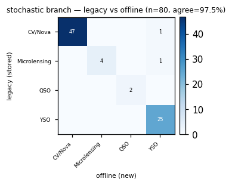
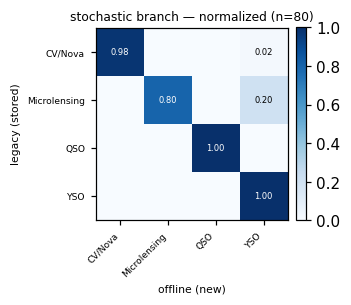

# Offline vs. legacy validation — features & BHRF classification

How we validated that the **offline ZTF pipeline** (`features/offline/`) reproduces
what the **deployed production pipeline** did, by comparing against the legacy
`alerce` DB. This documents the *method* (how we picked a comparison version, how
we selected the OIDs, how we validate) and the *findings* (results + where and why
things still differ).

> TL;DR — For the OIDs we can prove were classified with feature version **27.5.6**,
> our offline pipeline (features recomputed from `multisurvey_ztf`, LC truncated to
> the 27.5.6 epoch, AllWISE crossmatch via Xwave at radius 1.005″) reproduces the
> production BHRF **final class for 99.1%** of them. The residual differences are
> explained and non-systematic.

---

## 1. Choosing the version to compare against (→ 27.5.6)

The legacy features live in `alerce.feature` as `[oid, name, value, fid, version]`
— **there is no timestamp column**, and `alerce.probability` has no date or
feature-version link either. So "when did a version run / which version was used"
must be *inferred*.

### 1a. Dating versions by their light-curve cutoff

A version's features were computed on the LC available at run time, so the newest
detection it saw ≈ when it ran. The `Timespan` feature gives that per OID:

```
last_mjd_seen(oid, version) = firstmjd(oid, alerce.object) + Timespan(oid, version)
```

Aggregating over the cohort (run-date ≈ **p95/max** of `last_mjd_seen`; the min is
dominated by dormant objects) yields a timeline that is **monotonic in version
order** (the scheme is effectively CalVer):

| version | ≈ run date |
|---|---|
| 24.5.1 | 2024-08 |
| 25.0.x | 2024-09 … 12 |
| 26.0.x | 2024-12 … 2025-01 |
| 27.3.0 | 2025-03 |
| 27.5.4 | 2025-04 |
| **27.5.6** | **2025-10-27** |
| 27.5.7a32.dev1 | 2026, ongoing (max = today) |

*(Only versions that emit a `Timespan` feature — 24.5.1+ — can be dated this way;
`23.12.*` and `lc_classifier_1.2.1-P*` use an older feature schema.)*

### 1b. Why not the "obvious" latest version

Our comparison scripts had originally anchored on `27.5.7a32.dev1` (the full-LC
version) and `23.12.26a85`. Both turned out to have **~0% AllWISE populated**,
while almost every other version has WISE for ~92% of OIDs:

| version | OIDs with `W1-W2` populated |
|---|---|
| 25.x / 26.x / 27.3.0 / **27.5.6** / lc_classifier_1.2.1-P | **~91–93%** |
| **27.5.7a32.dev1** | **0%** |
| **23.12.26a85** | **0%** |

`27.5.7a32.dev1` and `23.12.26a85` are dev/alpha reprocessing builds that ran
**without the xmatch enrichment** (the feature step never ran `USE_XMATCH` for ZTF;
`multisurvey_ztf.xmatch` is empty). Comparing WISE against them is meaningless.

**Decision:** anchor on **27.5.6** — the most recent full release that actually
has WISE (2025-10-27).

---

## 2. Selecting the OIDs

### 2a. The eligible cohort (`select_cohort.py`)

Eligible = fair to compare:

- **Complete LC:** `multisurvey_ztf.object.lastmjd == alerce.object.lastmjd` (±0.5 d)
  — the reprocessed LC caught up to what the stored prediction saw.
- **Has stored BHRF 2.1.0** probabilities in `alerce.lc_classifier_bhrf_forced_phot`.
- Well sampled: `n_det ≥ 200`, top 3000 by `n_det`.

→ **2123 eligible OIDs** (`n_det` 1743–3987); 595 also match detection counts within 5.

### 2b. Which OIDs were actually classified with 27.5.6? (`reconstruct_2756.py`)

There is no metadata linking a stored probability to a feature version, so we use a
**deterministic reconstruction test**:

> Feed each OID's **stored 27.5.6 feature vector** directly into the BHRF model
> (no recomputation) and compare the predicted **classes** to the **stored BHRF
> probabilities**. If the classes match, that OID was classified with 27.5.6.

- Coverage check: 27.5.6's stored features cover **199/199** model inputs (after
  the naming reconciliation in §5c).
- **Compare by class, not by probability magnitude.** The argmax class is robust to
  small probability wobble; requiring a tight numerical match (`maxΔp < 0.01`)
  yielded only 12 OIDs, whereas **top-class agreement across all 5 heads holds for 559**:

  | heads with matching top class | # OIDs |
  |---|---|
  | **5/5** | **559 (26.4%)** ← the "class-perfect-27.5.6" cohort |
  | 4/5 | 470 |
  | 3/5 | 496 |
  | ≤2/5 | 596 |

The remaining ~1562 differ on ≥1 head → they were classified with a *different*
feature version (these best-sampled, still-active objects were mostly reclassified
after 27.5.6). Class agreement is **necessary but not strictly sufficient** to pin
27.5.6 (a numerically-adjacent version could yield the same classes), so "559" means
"classification consistent with 27.5.6."

---

## 3. How we validate

For the **559 class-perfect-27.5.6 OIDs** (`offline_predict_559.py`):

1. Recompute features with the **offline pipeline** from `multisurvey_ztf`.
2. **Truncate the LC** to each OID's 27.5.6 epoch: keep epochs with
   `mjd ≤ firstmjd + Timespan(oid, 27.5.6)` (≈ 2025-10-27). Without this, the offline
   full LC (to 2026-07) carries ~9 extra months of data and every time-dependent
   feature diverges — an artifact, not an error.
3. AllWISE crossmatch **live via Xwave at radius 1.005″** (offline default).
4. Classify with BHRF and compare the predicted **classes** to the DB.

⚠ **Model gotcha (must-do):** use the **local md5-verified SESN pickle**, not the
S3 URL. `SquidwardFeaturesClassifier` downloads a URL `MODEL_PATH` into
`/tmp/SquidwardFeaturesClassifier/` and **reuses whatever is already there** — that
dir holds a stale **SNIbc** pickle. Passing the URL silently loads the wrong model
(SESN↔SNIbc class mismatch + ~0.04 probability floor). A **local path** bypasses the
cache. Always assert `SESN ∈ model.list_of_classes and SNIbc ∉ …`.

| | file / md5 |
|---|---|
| ✅ correct (SESN) | `/home/fandrades/desktop/alerce_models/squidward/2.1.0/hierarchical_random_forest_model.pkl` — `95e8e9f18fde62f22025e31a88ad81fa` |
| ❌ stale cache (SNIbc) | `/tmp/SquidwardFeaturesClassifier/…pkl` — `565f4554…` |

---

## 4. Results

### 4a. AllWISE crossmatch — exact

Offline live-Xwave crossmatch (radius 1.005″) vs stored 27.5.6, pure-WISE colors
(LC-independent): **75/75 match, |Δ| ≈ 1e-6.** The crossmatch reproduces production
exactly. (Matches are all sub-0.3″, so 1.005″ vs 1.5″ is irrelevant.)

### 4b. Features — LC-truncated, apples-to-apples (25-OID sample)

| family | differ rate |
|---|---|
| color (WISE, pure) | ~0% |
| color (g-r) | 25% |
| simple-stat | 39% |
| fitted | 75% |

### 4c. Classification — the headline (559 OIDs)

| criterion | offline vs DB |
|---|---|
| **Flat (final) class** | **554/559 = 99.1%** |
| **All 5 heads** | **500/559 = 89.4%** |

Only **5 flat-class disagreements**, each a single borderline neighbor flip:
CV/Nova↔YSO, EB/EW↔EA, RRLc↔EB/EW, LPV→CV/Nova, Microlensing→RSCVn.

**Confusion matrices — legacy (stored DB) class (rows) vs offline (new) predicted
class (cols), 559 OIDs, per hierarchy level.** Cohort composition (by legacy top
head): Periodic 477, Stochastic 80, Transient 2. Absolute counts (left) +
row-normalized (right). Generated by `plot_confusion_heads.py` from
`offline_predict_559_heads.csv`.

**Top head** (Transient / Periodic / Stochastic) — 99.6% agree:

 

**Flat** (final leaf class) — 99.1% agree; essentially diagonal (EB/EW 201,
RRLab 169, CV/Nova 46, RRLc 34, EA 26, YSO 25, LPV 22, CEP 16, …), all off-diagonal
mass is the 5 single flips above:

 

**Periodic branch** (n=477, its members):

 

**Stochastic branch** (n=80, its members):

 

*(Transient branch has only 2 legacy members in this cohort — not shown; files
`confusion_transient_*.png` exist.)*

**Full chain validated:** WISE exact → 27.5.6 features→BHRF reproduce stored labels
(cohort definition) → **offline-recomputed features→BHRF reproduce stored labels 99.1%.**

---

## 5. Findings — where features differ and why

With the LC matched, differences fall into three classes.

### 5a. Fit & period nonuniqueness (high differ, low information)

Non-linear fits and period-derived quantities that amplify any microscopic input
change; the classifier is trained to treat them as noisy, and they are effectively
impossible to reproduce bit-for-bit across code/scipy versions.

- **Period-derived:** `Multiband_period` is mostly stable (~12% differ), but
  everything off the periodogram/folded curve — `Power_rate_*`, `PPE`,
  `Harmonics_phase_*`/`mag_*`, `Psi_*` — differs 90–100% (phases are angles →
  meaningless rel-diff).
- **Model fits:** `SPM_*` (scipy `minimize`, non-convex), `ulens_*`/`fleet_*`/`TDE_*`
  (degenerate for non-target objects → params essentially unconstrained),
  `GP_DRW_*`, `SF_ML_*`, `IAR_phi`, `MHPS_*`.

### 5b. Input provenance — `multisurvey_ztf` (reprocessed) ≠ legacy inputs

Same formula, different input data. **These are the meaningful, systematic ones:**

- **Forced photometry:** `n_forced_phot_band_after` (100%), `median_brightness_after_band`
  — reprocessed forced photometry uses different valid-epoch filtering (procstatus
  61→0).
- **PS1:** `distpsnr1` (100%, mean_rel 0.87) — different stored nearest-PS1 distance
  (`ps_*` colors still match → same star, recorded distance differs).
- **Reference images:** `mean/sigma_distnr`, `mean_sharpnr`, `mean_chinr` — different
  reference set/values (small, ~0.01–0.02).
- **Detection-set boundary:** `Timespan` itself differs ~36% (tiny), i.e. the
  truncated set isn't byte-identical to what 27.5.6 saw; higher moments
  (`Skew`, `SmallKurtosis`, `Beyond1Std`, …) amplify that into ~0.005–0.12 rel-diffs.

### 5c. Matched — the pipeline is correct

`W1-W2/W2-W3/W3-W4` (WISE), `Mean` magnitude, `Coordinate_x/y/z`, all
`*_brightness_before_band` — the core photometry, position, and crossmatch reproduce.

### 5d. A naming artifact (fixed)

The extractor/model use underscore `Power_rate_1_2`; the legacy DB stores slash
`Power_rate_1/2` (via a documented back-compat map in
`prepare_ao_features_for_db`). The offline compare (`feature_compare.py`) originally
joined on the raw name and split these into spurious `only_ours`/`only_theirs`.
Fixed by canonicalizing names (`/`→`_`) before the join. **Not** a model-input bug:
the model always received `Power_rate_1_2_12` with a real value.

### 5e. The 5 classification flips

Each is a borderline neighbor-class pair (CV/Nova↔YSO, EB/EW↔EA, RRLc↔EB/EW, …)
where the §5b provenance differences tip a near-tie the other way — expected, not
systematic breakage.

---

## 6. Reproduce

Scripts (session scratchpad): `select_cohort.py` (cohort), `reconstruct_2756.py`
(version-attribution / build the 559), `offline_predict_559.py` (offline recompute +
classify + compare). Key knobs: `MODEL_PATH` = **local** SESN pickle (§3),
`xmatch.DEFAULT_RADIUS = 1.005`, LC truncation cutoff = `firstmjd + Timespan(27.5.6)`.

## 7. Gotchas (do not relearn the hard way)

1. **Model cache trap** — URL `MODEL_PATH` reuses the stale SNIbc `/tmp` pickle; use a
   local path + assert SESN (§3).
2. **WISE-null versions** — never anchor WISE comparisons on `27.5.7a32.dev1` /
   `23.12.26a85` (0% WISE) (§1b).
3. **No timestamp / version link** in `alerce.feature` or `alerce.probability` — dates
   are inferred from `Timespan` (§1a); the version a prediction used is inferred by
   reconstruction (§2b).
4. **Compare classes, not probabilities**, for version attribution (§2b).
5. **Never full-scan `alerce.feature`** (GROUP BY times out); always filter by an
   `oid = ANY(:list)`.
6. **LC span dominates** any non-truncated comparison; truncate to the version's
   cutoff before reading anything into feature/class differences (§3).
