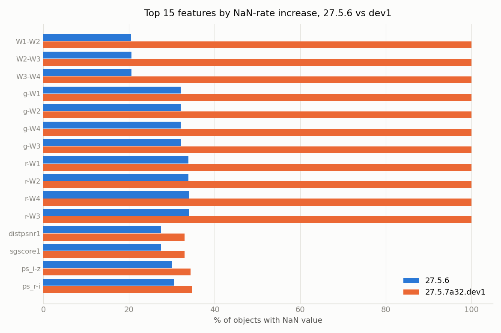
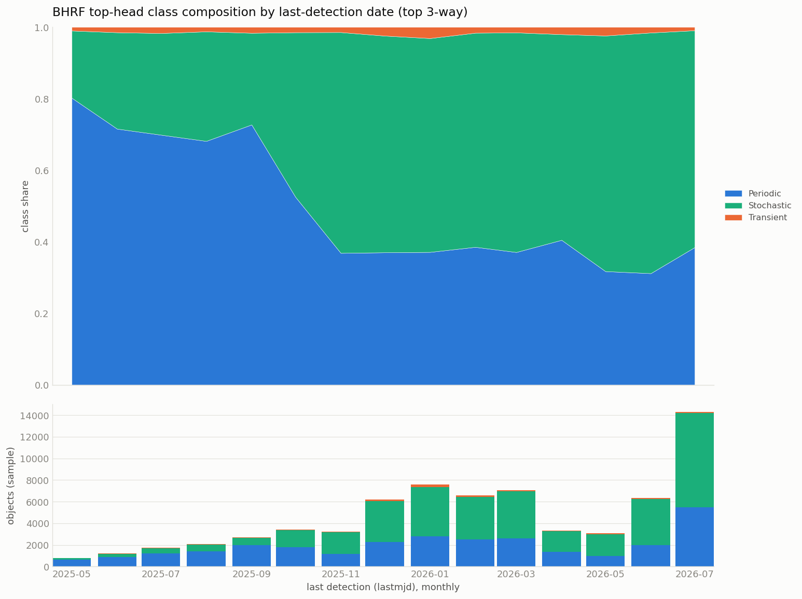
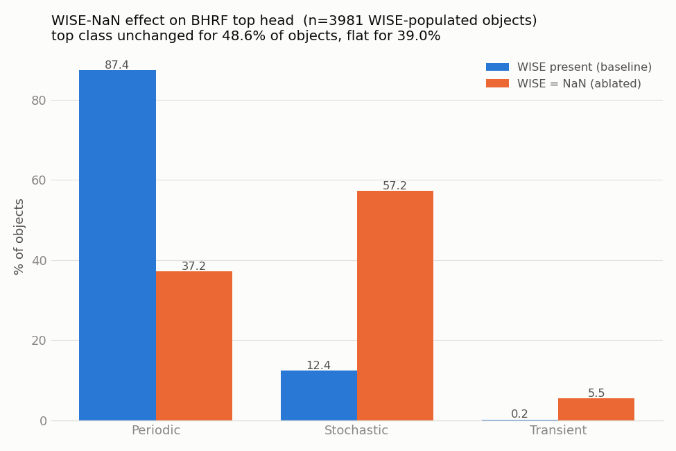
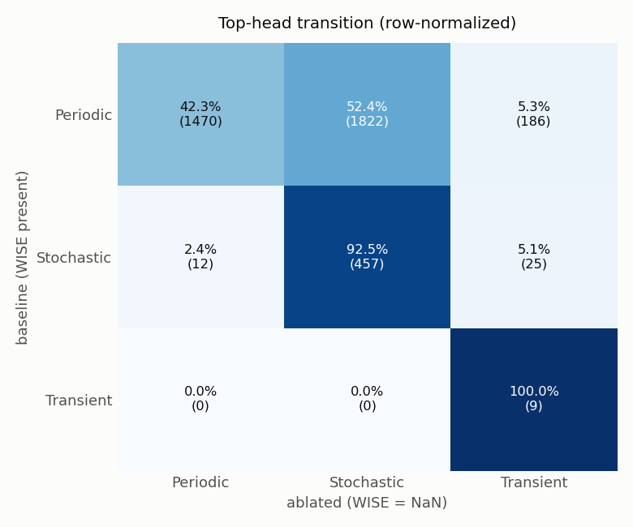

# Impact of missing AllWISE on BHRF classification

Recent ZTF feature versions have no AllWISE data — their WISE colors are all NaN (why
is still to be determined). This note documents what we found: BHRF relies on those
WISE colors to identify periodic variable stars, and without them it reclassifies about
half of the periodic objects as stochastic. We show this three ways — the feature NaN
rates, the stored probabilities over time, and a direct model ablation — and they
agree. We also confirm the missing WISE is recoverable.

## Summary

- The current feature version (`27.5.7a32.dev1`) has **100% NaN WISE colors**; the
  previous full release (`27.5.6`) has WISE for ~66–80% of objects. We don't yet know
  why `dev1` has no WISE. Estimated rollover date: **~October–November 2025**.
- In the database, objects last classified after the rollover dropped from **71.5% to
  36.8% Periodic**.
- A controlled ablation (blank only the WISE colors, same model, same objects) drops
  Periodic from **87% to 37%** — matching the database's "after" value (36.8% ≈ 37.2%).
- The missing WISE is **86% recoverable** with our xmatch client at 1.005″, so the data
  mostly exists — whatever the cause of the NaNs.

---

## 1. Feature versions and AllWISE

We measured the fraction of NaN values per feature in `alerce.feature`, comparing
`27.5.6` and `27.5.7a32.dev1`. Overall NaN rates are similar (47% vs 49%), but the
difference is concentrated entirely in the WISE colors: the eleven WISE features
(`W1-W2`, `W2-W3`, `W3-W4`, `g-W*`, `r-W*`) go from ~20–34% NaN in `27.5.6` to **100%
NaN** in `dev1` — `dev1` has no WISE photometry at all. We have not determined why;
that is still open. Everything else is roughly unchanged; period features are actually
slightly better populated in `dev1` (fuller light curve).

`alerce.feature` has no timestamp column, so we estimated when each version ran from
the newest detection it saw. That places `27.5.6` at roughly late October 2025 and
`dev1` running from then to today — so the WISE-less version took over around
**October–November 2025**.

## 2. Effect on the stored probabilities

`alerce.probability` stores one current prediction per object with no date. BHRF
re-runs whenever an object gets a new detection, so an object's last detection date
(`lastmjd`) is a good proxy for when it was last classified. We sampled the stored
BHRF predictions and grouped them by `lastmjd`.

The class composition steps sharply around October–November 2025 — the same date as
the feature rollover. Objects last classified before it are **71.5% Periodic**; after
it, only **36.8% Periodic**, with Stochastic taking over. At the leaf level, the
periodic classes (LPV, RSCVn, Periodic-Other) are replaced by CV/Nova and YSO.

The timing matches, but timing alone doesn't prove causation — so we tested the model
directly.

## 3. Ablation: the model without WISE

We took ~4,000 objects that do have WISE (stored `27.5.6` vector) and ran each through
BHRF twice from the identical vector: once as-is, once with only the eleven WISE colors
set to NaN. Only WISE changes, so any difference is caused by WISE.

Removing WISE changes the top-level class for **more than half** the objects. Periodic
falls from **87% to 37%**, Stochastic more than quadruples, and the change is
one-directional: **52% of periodic objects become stochastic**, while stochastic
objects mostly stay (92%). The leaf-level flips are the same ones seen in the database:
Periodic-Other, LPV, and RSCVn becoming CV/Nova and YSO.

The reason is that WISE infrared colors are a key feature for separating galactic
variable stars from accreting/eruptive sources. Without them the model, which was
trained with WISE present, defaults toward Stochastic.

## 4. The database and the model agree

| Periodic share | before | after |
|---|---|---|
| Database (last classified before → after rollover) | 71.5% | **36.8%** |
| Model ablation (WISE present → removed) | 87.4% | **37.2%** |

The "after" values are essentially identical (36.8% vs 37.2%), which is the key
evidence that the recent database predictions were made under the WISE-less condition.
The drop *sizes* differ (−35 vs −50 points) only because the "before" groups are
different populations (the ablation baseline is a clean WISE-present sample; the
database "before" is the specific set of objects that went quiet, already at 71.5%).

## 5. The missing WISE is recoverable

To check whether the missing WISE reflects absent data, we took a random sample of
objects that are WISE-null in `dev1` and re-ran the crossmatch with our xmatch client
(Xwave) at our standard 1.005″ radius. **86% (259 of 300) recovered a real WISE
magnitude.** So the missing WISE mostly exists and can be retrieved — the NaNs are not
due to absent counterparts.

## Conclusion

BHRF classifications for currently-active ZTF objects are systematically biased toward
Stochastic because their features have no WISE colors. Periodic variable stars
(RR Lyrae, LPV, eclipsing and RS CVn binaries) are the main casualties, mislabeled as
CV/Nova and YSO. Populating the WISE colors would fix it, and the required WISE data is
fully recoverable. Why the recent features lack WISE is still to be determined.

## Caveats

- No column links a stored prediction to a feature version; §2 and §4 rely on the
  `lastmjd` proxy plus the estimated version dates. The direct confirmation would be
  attribution by reconstruction (feed each object's `27.5.6` and `dev1` vector to BHRF
  and see which reproduces the stored prediction). Not yet run.
- The ablation predicts slightly more Transient (~5.5%) than the recent database shows
  (~1.8%), because real `dev1` vectors also have better-populated period features that
  suppress transient calls; our ablation only touched WISE.
