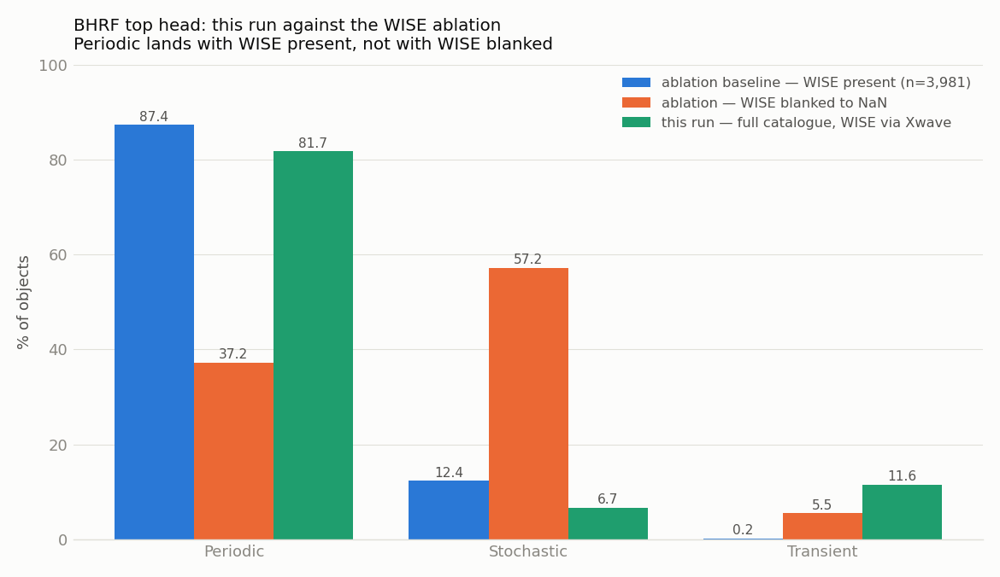
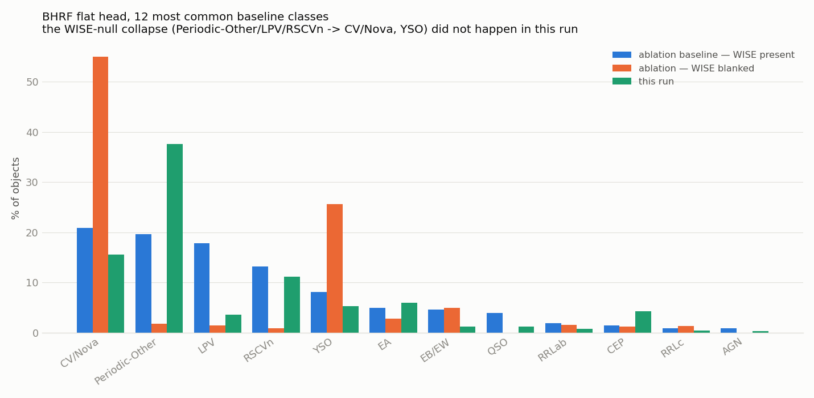
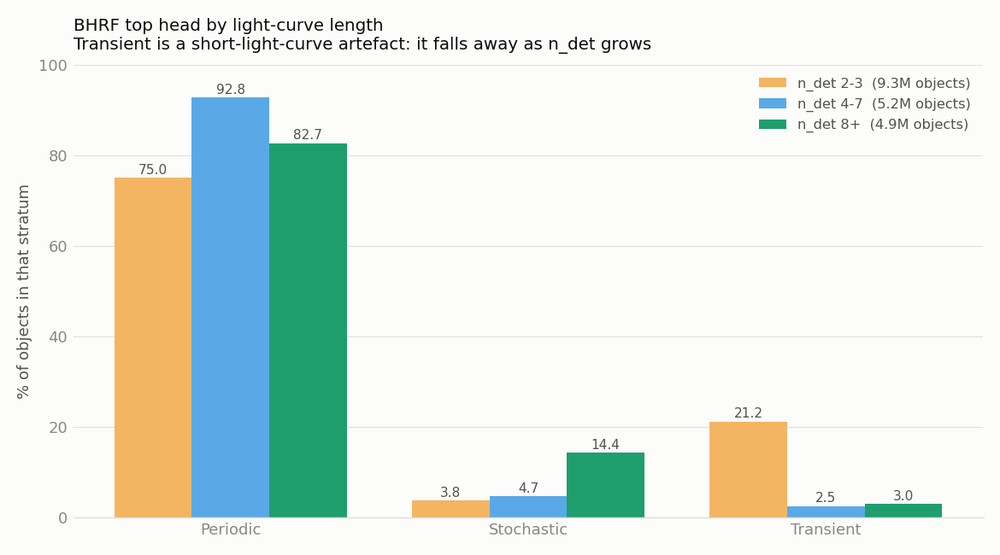
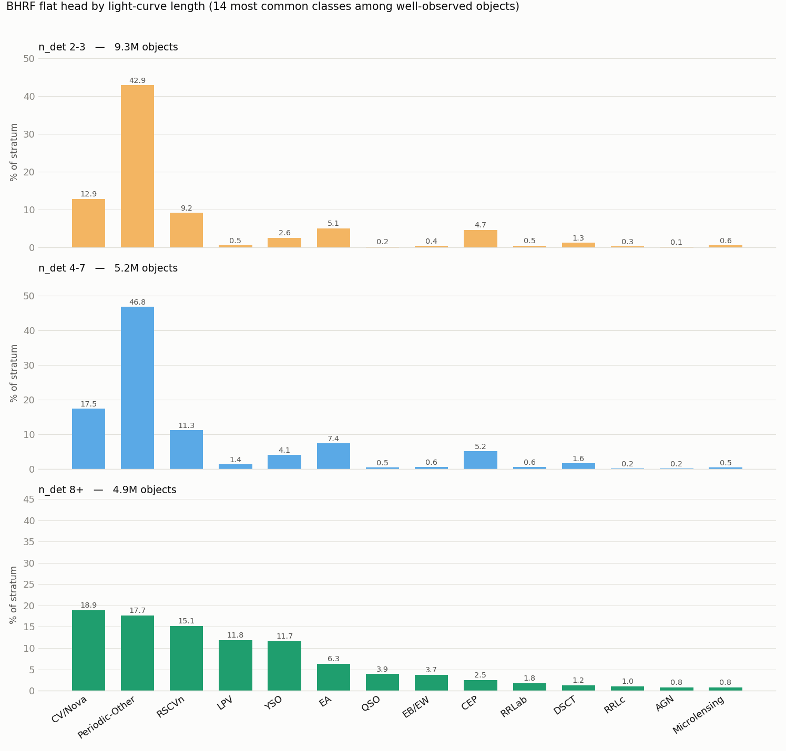

# This run against the WISE ablation

`WISE_NULL_CLASSIFICATION_IMPACT.md` showed that BHRF collapses toward Stochastic
when the AllWISE colors are missing, and predicted that restoring the crossmatch
would fix it. This run is the test at full scale. **It lands on the WISE-present
side, decisively.**

Reproduce with:

```bash
python features/offline/run_stats/plot_run_vs_ablation.py
```

Both ablation bars are recomputed from `wise_ablation/wise_ablation.csv` rather
than quoted from the note, so they cannot drift from the source data. This run's
bars come from `class_distribution.csv`, written by `offline_db_stats.py`.

## Read this first: the populations differ

Only the two ablation bars are a controlled comparison — the *same* 3,981
objects, predicted twice from the same feature vector, with only the eleven WISE
colors changed. This run's bar is a different population: 19.3M objects at
`n_det >= 2`, of which 80.5% matched AllWISE at all. The ablation sample was
selected for *having* WISE and a stored `27.5.6` vector, so it is far
better-observed than the catalogue at large.

So a bar-height difference between this run and the baseline is not by itself a
WISE effect. What survives that caveat is the Periodic/Stochastic axis, where the
ablation effect (87% → 37%) is far too large for any population difference to
imitate.

## Top head



| class | WISE present | WISE blanked | this run |
|---|---:|---:|---:|
| Periodic | 87.4% | 37.2% | **81.73%** |
| Stochastic | 12.4% | 57.2% | **6.70%** |
| Transient | 0.2% | 5.5% | **11.57%** |

**Periodic and Stochastic: the run is on the WISE-present side, unambiguously.**
81.7% Periodic against 87.4% with WISE and 37.2% without; 6.7% Stochastic against
12.4% and 57.2%. The WISE-null signature is a Stochastic share near 57% — this run
is nowhere near it. For comparison, the database's post-rollover state was 36.8%
Periodic. The crossmatch did what the note said it would.

**Transient does not fit either bar, and WISE cannot explain it.** At 11.57% the
run is *above* both the WISE-present baseline (0.2%) and the WISE-blanked one
(5.5%), and above the ~1.8% the note measured in the database. Blanking WISE
moves Transient by +5.3 points, so no amount of WISE effect produces 11.6% from a
0.2% baseline.

The cause is the cut this run classified on. `n_det >= 2` admits objects with
almost no light curve, and a sparse light curve is what a transient looks like —
so a higher Transient share is the expected consequence of predicting over this
population, not a defect. Every prior measurement was taken on a better-observed
set: the ablation sample required a stored `27.5.6` vector, and the database
figure is dominated by objects the live pipeline had already seen many times.

The NaN rates in `DB_STATS.md` show the same population from the feature side —
`MHPS_*` missing for 91% of objects, `Rcs`/`Skew`/`Std` for 89%, all of them
features that need a populated curve.

This is now measured rather than argued — see [Stratified by
n_det](#stratified-by-n_det) below. Transient is **21.19%** at `n_det` 2-3 and
**2.50%** at 4-7. It is not a gradient but a cliff, and the 11.57% catalogue-wide
figure is simply that stratum's weight: 48% of the run has two or three
detections.

Worth stating plainly for anyone using these predictions: **the Transient share
here is a property of the `n_det >= 2` cut and should not be compared against
numbers measured on brighter cuts.**

## Flat head



The WISE-null signature at leaf level is specific: CV/Nova 20.9% → 54.9% and YSO
8.1% → 25.6%, while Periodic-Other collapses 19.6% → 1.8%, LPV 17.9% → 1.4% and
RSCVn 13.2% → 0.9%.

None of that happened here. Periodic-Other is this run's largest class at 37.6%,
RSCVn holds at 11.2%, and CV/Nova (15.6%) and YSO (5.3%) sit at or below the
WISE-present baseline rather than three times above it. The leaf-level collapse
the note documented is absent.

Two differences from the baseline that are *not* the WISE signature:

- **LPV 3.6% against a 17.9% baseline**, with Periodic-Other correspondingly high
  (37.6% vs 19.6%). Periodic-Other is absorbing objects that a better-sampled
  light curve would resolve as LPV. Confirmed two ways below: by period presence
  and by `n_det`.
- **QSO 1.2% against 3.9%**, consistent with the same direction (3.91% at
  `n_det >= 8`, on the baseline's nose).

## Periodic-Other is the no-period bucket

`Multiband_period` is absent for **74.94%** of objects, and the rest of the
period machinery is worse (`Harmonics_*` ~78%, `Psi_eta`/`Psi_CS` ~86%) against a
65.87% overall mean — period features are the most-missing family in the run.

A period is what separates the periodic *subclasses*. Without one the model can
still tell "this varies smoothly, it is not stochastic" and land in the Periodic
branch, but it cannot tell RRLyrae from LPV from Cepheid. Periodic-Other is where
that goes.

Joining `Multiband_period` presence to the rank-1 class, per object, over
`feature_part_0` (606,210 objects, 75.0% of them with no period):

| class | % lacking a period | share if **no** period | share if **has** period |
|---|---:|---:|---:|
| Periodic-Other | **92.35%** | **46.27%** | **11.48%** |
| CV/Nova | 51.86% | 10.79% | 30.03% |
| RSCVn | 69.74% | 10.44% | 13.58% |
| YSO | 37.71% | 2.67% | 13.20% |
| **LPV** | 26.19% | 1.27% | **10.75%** |
| SLSN | 99.91% | 8.34% | 0.02% |

Periodic-Other is **4x more prevalent when there is no period** (46.27% vs
11.48%), and 92.35% of everything it labels has none. LPV is the mirror image —
**8.5x more prevalent when a period exists**. That is the substitution, measured.

The transient classes tell the same story from the other side: SLSN 99.91% without
a period, SNII 98.38%, SNIIn 99.40%, SNIa 95.10%, TDE 89.32%.

## Stratified by n_det

`plot_class_by_ndet.py` joins `probability_part_0` to `object_part_0` and splits
the predictions by light-curve length. (`probability` is HASH(oid) over 16
partitions and `object` over 8, so `hash % 16 == 0` implies `hash % 8 == 0` —
the join loses nothing, it is a complete 1/16 sample.) Strata: **9.26M / 5.19M /
4.89M** objects.



| top head | 2-3 | 4-7 | 8+ | ablation baseline |
|---|---:|---:|---:|---:|
| Periodic | 75.02 | 92.82 | 82.67 | 87.36 |
| Stochastic | 3.79 | 4.68 | 14.37 | 12.41 |
| Transient | **21.19** | 2.50 | 2.96 | 0.23 |



| flat head | 2-3 | 4-7 | 8+ | ablation baseline |
|---|---:|---:|---:|---:|
| Periodic-Other | 42.91 | 46.83 | **17.68** | 19.62 |
| CV/Nova | 12.85 | 17.47 | 18.90 | 20.85 |
| RSCVn | 9.16 | 11.26 | 15.14 | 13.21 |
| LPV | 0.55 | 1.43 | **11.84** | 17.86 |
| YSO | 2.61 | 4.15 | 11.66 | 8.14 |
| EA | 5.10 | 7.42 | 6.28 | 4.92 |
| QSO | 0.23 | 0.54 | 3.91 | 3.94 |
| EB/EW | 0.42 | 0.59 | 3.70 | 4.62 |
| CEP | 4.67 | 5.20 | 2.51 | 1.48 |
| RRLab | 0.52 | 0.60 | 1.76 | 1.96 |

**The `n_det >= 8` stratum reproduces the WISE-present baseline.**
Periodic-Other falls 46.83 → 17.68 against a baseline of 19.62; LPV climbs 1.43 →
11.84; CV/Nova, RSCVn, QSO, EB/EW and RRLab all land within a couple of points.
Give the model a light curve and it returns the baseline distribution — which is
the cleanest statement available that neither anomaly is a defect in the run.

Two things that do NOT fit the tidy version, and should not be smoothed over:

- **Both effects are non-monotonic.** Periodic-Other *rises* 42.91 → 46.83 before
  collapsing at 8+, and Transient sits lower at 4-7 (2.50) than at 8+ (2.96). So
  this is not a smooth degradation with fewer detections; something changes
  qualitatively around 8, plausibly where period-finding starts to converge.
  **That last part is a guess.** The finer bins in `class_by_ndet.csv`
  (`8-15`, `16-31`, `32-63`, `64+`) would locate it without another scan.
- **`n_det >= 8` narrows the gap but does not close it.** LPV is 11.84 against
  17.86, and Transient 2.96 against 0.23. The ablation sample was better-observed
  than "eight or more detections" — it required a stored `27.5.6` vector — so
  some of the residual is still population, not model.

Reproduce with:

```bash
python features/offline/run_stats/plot_class_by_ndet.py
```

## Conclusion

The run reproduces the WISE-present condition on the axis the note was about.
The Periodic/Stochastic split is restored and the leaf-level collapse into
CV/Nova and YSO did not occur, so the predictions in the database are not
affected by the WISE-null bias that motivated the investigation.

The two departures from the baseline are both the `n_det >= 2` cut, and both are
measured rather than assumed. Transient is 21.19% at `n_det` 2-3 and 2.50% by
4-7; Periodic-Other is the bucket for the 74.94% of objects with no period, 4x
more prevalent without one and 92.35% period-less in what it labels. At
`n_det >= 8` the distribution returns to the WISE-present baseline on almost
every class.

Neither is a defect in the run. Both mean the same thing for anyone using these
predictions: **the class shares here describe the `n_det >= 2` population and are
not comparable to numbers measured on brighter cuts.** For work that needs a
clean distribution, stratify by `n_det` or cut at 8 — `class_by_ndet.csv` has the
shares per stratum.
