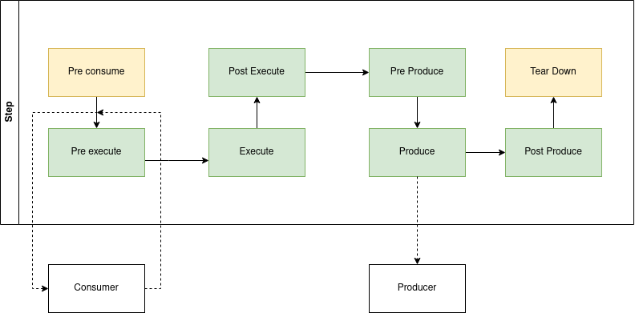

Step documentation
==================

A step has a well defined flow of data, starting from message consumption to message production. No matter what kind of consumer or producer you are using, the flow of data always follows what is called the Step Life Cycle.

Step lifecycle
--------------
There are 8 stages inside a Step. Each stage can be customized by overriding the method from :py:class:`apf.core.step.GenericStep` for that lifecycle stage.

1. Pre Consume
++++++++++++++
:py:func:`apf.core.step.GenericStep.pre_consume`

Called only once after :py:func:`apf.core.step.GenericStep.start`. Can be used to prepare data or fetch something needed to begin processing.

2. Pre Execute
++++++++++++++
:py:func:`apf.core.step.GenericStep.pre_execute`

Called after every batch of messages is consumed. Receives the raw message as returned by the consumer.

Override this method to perform operations on each batch of messages consumed.

Typically this method is used for pre processing operations such as parsing,
formatting and overall preparation for the execute method that handles
all the complex logic applied to the messages.

By default, data is returned as is, without modifications.

3. Execute
++++++++++
:py:func:`apf.core.step.GenericStep.execute`

Where all the logic go. Called for each batch of messages consumed as returned by the :py:func:`apf.core.step.GenericStep.pre_execute` method.

This method **should always return** the result of the processing operation and must be a list of dictionaries or a single dictionary.

4. Post Execute
+++++++++++++++
:py:func:`apf.core.step.GenericStep.post_execute`

Called after every batch processed by the :py:func:`apf.core.step.GenericStep.execute` method

Override this method to perform additional operations on
the processed data coming from :py:func:`apf.core.step.GenericStep.execute`
method.

Typically used to do post processing, parsing, output formatting, etc.

This method **should always return** a list of dictionaries or a single dictionary.

5. Pre Produce
++++++++++++++
:py:func:`apf.core.step.GenericStep.pre_produce`

Override this method to perform additional operations on
the processed data coming from :py:func:`apf.core.step.GenericStep.post_execute`
method.

Typically used to format data output as described in the step producer's Schema

This method **should always return** a list of dictionaries or a single dictionary.

6. Produce
++++++++++
:py:func:`apf.core.step.GenericStep.produce`

This method should *not* be overriden. It is the method that performs output from the step, producing with the configured producer.

7. Post Produce
+++++++++++++++
:py:func:`apf.core.step.GenericStep.post_produce`

Called after each batch of messages has been produced.

Override this method to perform operations after data has been
produced by the producer.

You can use this lifecycle method to perform cleanup, send additional metrics,
notifications, etc.

8. Tear Down
++++++++++++
:py:func:`apf.core.step.GenericStep.tear_down`

This method is called only once after processing messages and right before
the start method ends.

Override this method to perform operations after the consumer
has stopped consuming data.

You can use this lifecycle method to perform cleanup, send additional metrics,
notifications, etc.
