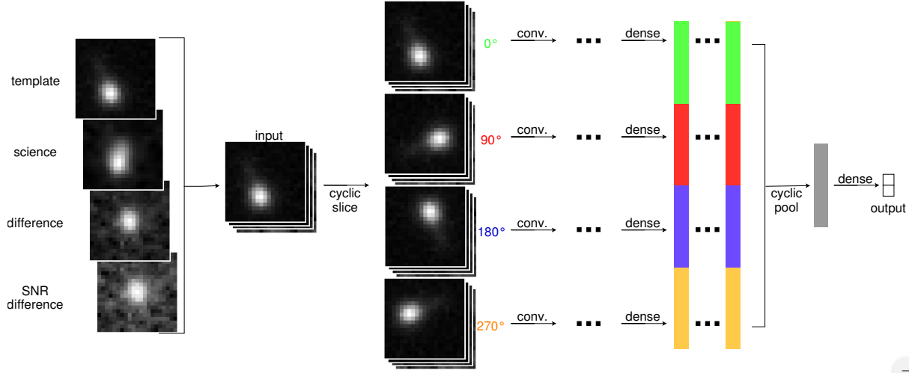

# Early Stamp Classifier
[](https://travis-ci.com/alercebroker/stamp_classifier)

The Early Stamp Classifier uses the first detection stamps from an object to make a classification.


**TODO: Add the paper link for this model.**

## Architecture

The architecture of the Stamp Classifier is based on [Deep-HiTS: Rotation Invariant Convolutional Neural Network for Transient Detection](https://arxiv.org/abs/1701.00458).

Uses a cyclic slicing with a convolutional network then to be combined with a cyclic pooling layer into a dense softmax layer.




## Deployment

The current deployment of the Stamp Classifier is done with a Flask API.

The common interface between [Tensorflow](https://www.tensorflow.org/) and Flask is the  `deployment.StampClassifier` class. (Will be changed to [Tensorflow Model Serve](https://www.tensorflow.org/tfx/guide/serving))

When the model has been updated it has to be deployed as a Docker Container, to do that first we need to create the corresponding docker image.

```
  docker build -t stamp_classifier .
```

Then we can create the Container
```
  docker run -d -p 5000:5000 --name stamp_classifier stamp_classifier
```

To check if the service is running just run
```
  curl http://localhost:5000
```
if the service is running it will show a welcome message.

## Using the API

To use the API we need to send the stamps to `POST /get_classification`
```
  curl -F 'cutoutScience=@/path/to/cutoutScience'  \
       -F 'cutoutDifference=@/path/to/cutoutDifference' \
       -F 'cutoutTemplate=@/path/to/cutoutTemplate' \
       http://localhost:5000/get_classification
```

This will return a *JSON* object with the classification scores.
